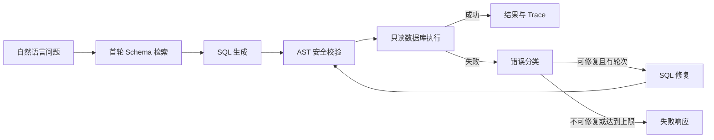

# Chain-NL2SQL

基于 LangGraph 的链式自纠错 NL2SQL 项目，集成 Schema-RAG、SQL 安全治理和可复现实验评测。

> 项目状态：P0 的基础组件已部分实现，但端到端 NL2SQL 工作流尚未完成。下面的状态以当前仓库代码为准；“目标能力”不代表已上线功能。

## 当前实现状态

状态说明：`V` 为已实现；`X` 为尚未完成或尚未接入完整业务链路。最近一次核对：2026-08-19。

### 服务与 API

| 状态 | 功能 | 当前情况 |
| --- | --- | --- |
| V | 环境配置 | 从 `.env` 读取服务、模型、超时、轮次和数据库白名单配置。 |
| V | 启动配置校验 | 限制本机绑定地址，校验最大轮次、查询超时、结果行数和数据库白名单。 |
| V | FastAPI 应用工厂 | 已创建应用并注册系统路由和业务路由。 |
| V | 健康检查 | `GET /health` 返回服务状态和运行环境。 |
| V | 数据库列表接口 | `GET /api/v1/databases` 仅返回服务端允许的数据库 ID。 |
| V | 请求上下文 | 支持透传或生成 `X-Request-ID`，并加载本地访问策略。 |
| V | 查询请求校验 | 校验问题、数据库 ID 和最大修复轮次的输入范围。 |
| X | 查询接口 | `POST /api/v1/query` 仍固定返回 `501 Not Implemented`。 |
| X | Graph 结果响应映射 | `map_query_state` 仍抛出 `NotImplementedError`。 |
| X | 生产鉴权与权限 | 尚未实现 API Key、RBAC、用户身份和调试 SQL 权限控制。 |

### 数据库与 SQL 安全

| 状态 | 功能 | 当前情况 |
| --- | --- | --- |
| V | SQLite 只读连接 | 使用 `mode=ro` URI 打开数据库，防止驱动层写入。 |
| V | SQLite Schema 读取 | 读取业务表、字段、主键和外键，并排除 SQLite 系统表。 |
| V | Schema 版本指纹 | 基于规范化 Schema 文本计算 SHA-256 版本哈希。 |
| V | SQL AST 解析 | 使用 `sqlglot` 解析 SQL，限制为单条语句。 |
| V | 只读 SQL 校验 | 拒绝写操作、DDL、控制语句、多语句、注释、系统表和危险函数。 |
| V | 表与字段白名单 | 支持按访问策略校验允许访问的表和字段。 |
| V | 受限 SQL 执行 | 支持参数绑定、查询截止时间和 SQLite progress handler 中断。 |
| V | 结果安全格式化 | 支持结果行数上限、截断标记和敏感字段掩码。 |
| X | MySQL 适配器 | 文件仅为占位，尚未实现连接、Schema 读取和只读执行。 |
| X | 多数据库适配器编排 | 尚未根据 `database_id` 构建和复用数据库适配器。 |
| X | 经授权外部数据库连接 | 规划支持服务管理员预先登记的外部 MySQL 数据库；需实现数据库注册表、凭据引用、TLS、连接超时、Schema 读取和只读账号执行。客户端仅可提交已授权的 `database_id`，不得提交任意地址、连接串或密码。 |

### LLM 组件

| 状态 | 功能 | 当前情况 |
| --- | --- | --- |
| V | OpenAI 兼容客户端 | 可创建 `ChatOpenAI` 客户端，并支持自定义兼容 API 地址。 |
| V | 模型配置校验 | 真实调用前校验 `OPENAI_API_KEY` 和 `OPENAI_MODEL`。 |
| V | SQL 生成 Prompt | 已提供约束单条只读 SQL 输出的生成模板。 |
| V | SQL 修复 Prompt | 已提供复用固定 Schema 与脱敏错误信息的修复模板。 |
| V | 模型输出提取 | 可移除 Markdown SQL 围栏并拒绝多语句输出。 |
| V | 超时与重试 | 对短暂模型故障执行有总预算限制的指数退避重试。 |
| X | 真实 NL2SQL 模型调用 | LLM 客户端尚未由任何 Graph 节点调用。 |

### Schema-RAG

| 状态 | 功能 | 当前情况 |
| --- | --- | --- |
| V | Schema 元数据标准化 | 已定义表、字段、外键的方言无关数据模型。 |
| V | Schema 文档构建 | 可将表结构渲染为稳定、适合模型读取的 Schema 文档。 |
| V | 检索接口契约 | 已定义 `SchemaRetriever` 协议和固定 Schema 版本返回模型。 |
| X | Schema 检索 | 尚未实现根据问题筛选相关 Schema 文档。 |
| X | ChromaDB 向量检索 | 向量存储文件为空壳。 |
| X | BM25 关键词检索 | BM25 存储文件为空壳。 |
| X | 混合召回与重排 | 混合检索器和 Reranker 文件为空壳。 |
| X | 索引构建与版本管理 | 索引管理文件为空壳。 |

### LangGraph 自纠错工作流

| 状态 | 功能 | 当前情况 |
| --- | --- | --- |
| V | 工作流状态模型 | 已定义请求、Schema、SQL、结果、错误和 Trace 状态字段。 |
| V | 初始状态创建 | 可初始化请求 ID、问题、数据库、方言、轮次和运行状态。 |
| V | 修复路由规则 | 已定义可修复错误类别和最大轮次判断。 |
| X | Graph 构建 | `build_query_graph` 仍抛出 `NotImplementedError`。 |
| X | 问题范围判断 | 尚未实现数据库查询、非数据库问题和无法判断问题的意图分流。 |
| X | Schema 检索节点 | 尚未提供节点实现。 |
| X | SQL 生成节点 | 节点文件为空壳。 |
| X | SQL 校验节点 | 节点文件为空壳。 |
| X | SQL 执行节点 | 节点文件为空壳。 |
| X | 错误分类节点 | 尚未实现并接入工作流。 |
| X | SQL 修复节点 | 节点文件为空壳。 |
| X | 收尾节点 | 节点文件为空壳，尚不能生成 API 安全响应。 |
| X | 自纠错闭环 | 尚未把生成、校验、执行、分类和修复串联为可运行图。 |

### 错误治理与可观测性

| 状态 | 功能 | 当前情况 |
| --- | --- | --- |
| V | 本地访问策略 | 已配置演示数据库、表、字段白名单和邮箱掩码。 |
| V | 基础错误脱敏 | 可脱敏常见数据库连接 URL。 |
| V | 日志入口 | 提供不自动添加 handler 的标准日志获取函数。 |
| X | 错误分类器 | 文件为空壳，尚未映射模型和数据库异常。 |
| X | Trace 记录 | 文件为空壳，尚未持久化或返回节点 Trace。 |
| X | 指标聚合 | 文件为空壳，尚未统计延迟、轮次和修复成功率。 |
| X | 用户安全错误响应 | 尚未完成 Graph 错误到 API 响应的白名单映射。 |

### 前端

| 状态 | 功能 | 当前情况 |
| --- | --- | --- |
| V | Vue 应用与路由 | 已配置 Vue 3、Element Plus 和 `/knowledge` 路由。 |
| V | 工作区布局 | 已实现桌面侧栏、移动端抽屉和响应式页面框架。 |
| V | 知识库页面 | 已实现文档列表、筛选、上传状态和删除交互。 |
| V | Mock API | 默认 Mock 模式可模拟知识库、查询和审批数据。 |
| V | HTTP 客户端封装 | 已封装数据库列表和查询请求，以及统一错误转换。 |
| X | 查询页面 | 当前无自然语言查询输入、结果表格和执行链路页面。 |
| X | 审批页面 | 当前无审批列表、详情和审批操作页面。 |
| X | 知识库后端接口 | 后端尚未提供列表、上传和删除接口。 |
| X | 查询与审批后端接入 | Mock 查询/审批数据未接入实际后端能力。 |

### 测试、构建与评测

| 状态 | 功能 | 当前情况 |
| --- | --- | --- |
| V | 后端单元测试 | 最近一次 `pytest` 运行共 26 项，全部通过。 |
| V | SQLite Demo fixture | 已提供确定性 SQLite 初始化脚本和测试数据。 |
| V | LLM Fake 测试 | 已使用可注入 Stub/Fake 覆盖模型客户端、Prompt 和重试逻辑。 |
| X | 前端 Vitest 测试 | 当前配置未找到测试文件，`pnpm test` 退出失败。 |
| X | 前端 E2E 测试 | 虽有 Playwright 用例，但当前路由不存在用例所需的查询界面，尚未通过端到端验证。 |
| X | 前端生产构建 | `pnpm build` 受 Vite/Element Plus 类型依赖冲突阻断。 |
| X | CSpider/Spider 评测 | 尚无数据集接入、单轮基线、EX Accuracy 或评测报告。 |

### 当前可用范围

- 可作为后端组件库验证：健康检查、数据库白名单、SQLite Schema 读取、受限只读 SQL 执行、LLM 客户端与 Prompt。
- 不可作为完整 NL2SQL 服务使用：查询接口尚未编排 Graph，因此不会生成、修复或执行自然语言查询。
- 前端默认启用 Mock API，适合查看知识库界面交互；将 `VITE_USE_MOCK_API=false` 后，除已实现的数据库列表外，其余业务接口尚未可用。

## 项目目标

NL2SQL 的难点不只是让模型生成一条 SQL，而是让生成结果能够安全执行、在失败后可解释地修复，并通过执行准确率证明方案有效。

Chain-NL2SQL 将一次查询拆成受控的 Agent 流程：



## 目标能力

- **LangGraph 自纠错闭环**：使用显式 State、条件分支和最大轮次控制，而不是黑盒 SQL Agent。
- **问题范围判断**：在 Schema 检索前识别非数据库问题，避免无关问题被强行转换为 SQL；无法判断时要求用户补充信息。
- **Schema-RAG**：首次检索后固定 `schema_context` 和 `schema_version`，修复阶段不重复检索，避免 Schema 漂移。
- **安全执行**：基于 `sqlglot` AST 的只读策略、专用只读数据库账号、超时取消、表/字段白名单与结果脱敏。
- **错误治理**：内部原始异常、持久化 Trace、用户响应三层隔离，避免泄露连接串、路径、堆栈和敏感数据。
- **可评测性**：通过 CSpider/Spider 的 EX Accuracy、修复成功率、平均轮次和失败分类，对比单轮 NL2SQL 基线。

## 开发阶段

| 阶段 | 范围 | 验收结果 |
| --- | --- | --- |
| P0 | LangGraph 主链路、固定 SQLite Demo、基础 Schema 读取、SQL 安全校验、FastAPI、日志与测试 | 完成成功查询、SQL 修复、安全拦截和受控失败 |
| P1 | ChromaDB + BM25 混合检索、Reranker、MySQL、评测与基线对照 | 可重复输出 EX、轮次、延迟和失败分类 |
| P2 | Human-in-the-Loop、Example-RAG、Vue3 + Element Plus 前端 | 可审批 SQL、展示完整链路并支持 Few-shot 示例 |

## 技术栈

| 模块 | 组件 |
| --- | --- |
| Agent 编排 | LangGraph、LangChain |
| LLM | DeepSeek-Coder、Qwen2-7B-Instruct、GPT-4o-mini（OpenAI 兼容接口） |
| 检索 | ChromaDB、BGE-small-zh、BM25、bge-reranker-small |
| SQL 安全 | sqlglot、SQLite 只读 URI、MySQL 只读账号 |
| 服务与类型 | FastAPI、Pydantic v2、Uvicorn |
| 前端 | Vue 3、TypeScript、Vite、Tailwind CSS、Element Plus、Pinia |
| 评测 | datasets、CSpider、Spider |
| 测试 | pytest、httpx、可编排 `fake_llm` |

## 模块边界

```text
app/
├── api/             # 路由、认证/权限、响应映射
├── config/          # 配置读取和启动校验
├── graph/           # State、节点、路由和 Graph 构建
├── llm/             # 模型适配、Prompt、输出解析和重试
├── rag/             # 元数据、索引、检索和重排
├── db/              # 适配器、连接、SQL 策略和结果格式化
├── errors/          # 分类和脱敏
└── observability/   # Trace、日志和指标

evals/               # 基线、批量评测和报告
tests/               # 单元、集成和 fake LLM
data/                # SQLite Demo、Schema 快照和 fixtures
web/                 # P2 前端
```

模块之间通过稳定接口通信：Graph 依赖检索、模型和数据库抽象，不直接依赖具体 SDK 或驱动实现。完整职责拆分见下方开发文档。

## 开发文档

- [项目说明文档](docs/项目说明文档.md)：架构、状态定义、节点路由、API、RAG、安全、评测、目录与测试策略。

## 安全边界

- P0 仅面向本机开发环境，服务绑定 `127.0.0.1`。
- 默认不在 API 响应中返回 SQL；P1 仅允许具备认证和调试角色的调用方查看脱敏 SQL。
- 仅执行通过 AST 校验的单条只读查询，拒绝写入、DDL、多语句和危险系统操作。
- 结果受表/字段白名单、字段掩码和可选行级过滤约束。
- 数据库和模型的真实密钥只通过 `.env` 注入，不提交到仓库。
- 外部数据库仅限所有者授权且由服务端预先登记的目标；使用专用只读账号、主机和端口白名单及 TLS，禁止根据客户端输入直接建立网络连接。

## 计划产物

- 可运行的 SQLite NL2SQL Demo 与固定测试数据。
- `/api/v1/query` 查询接口、健康检查和受控 Trace。
- 单轮基线与链式自纠错方案的评测报告。
- P2 的审批流、Example-RAG 和可视化链路页面。
- 经授权外部 MySQL 数据库的注册、只读连接、Schema 读取和安全执行能力。

详细实现规范、接口约束和验收标准请阅读：[docs/项目说明文档.md](docs/项目说明文档.md)。
