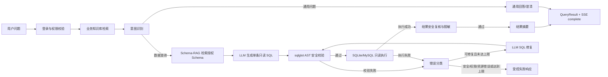

# Chain-NL2SQL

Chain-NL2SQL 是一个面向企业数据分析场景的自然语言查询系统（NL2SQL）。用户用中文或英文描述问题，系统会结合业务知识和数据库 Schema 生成 SQL，在执行前完成安全校验，查询失败时自动分类并尝试修复，最后通过 SSE 返回结果和处理进度。

项目重点不是“让模型写出一条 SQL”，而是把生成、检索、校验、执行、修复和结果解释组织成一个可控、可审计的工作流。

## 核心能力

- **LangGraph 自纠错工作流**：显式 State、条件路由和最大迭代次数，支持生成失败后的受控 SQL 修复。
- **Schema-RAG**：按问题召回授权的表、字段和关联关系，支持 BM25、向量检索和 Hybrid 混合召回。
- **业务知识库 RAG**：检索指标口径、业务规则和数据字典，为意图判断和 SQL 生成提供背景信息。
- **安全只读执行**：使用 `sqlglot` AST 校验单条只读 SQL，限制数据库、表和字段访问，并执行超时、行数限制和结果脱敏。
- **多数据库适配**：内置 SQLite 和 MySQL 适配器，数据库由服务端登记和授权，客户端不能直接指定任意连接地址。
- **流式 API 与会话**：FastAPI 提供 SSE 查询接口；登录会话、查询进度、结果快照和上下文存储在服务端 SQLite 中。
- **Web 管理界面**：Vue 前端提供自然语言查询、数据库管理、知识库管理、成员管理和查询过程展示。

## 工作流程



一次数据查询会固定本次请求使用的 Schema 版本；修复阶段复用同一份 Schema 上下文，避免数据库结构变化导致上下文漂移。任何无法证明安全的 SQL 或结果都会失败关闭，不会继续执行或返回原始敏感信息。

## 技术栈

| 层次 | 技术 |
| --- | --- |
| Agent 编排 | LangGraph、LangChain |
| LLM | `langchain-openai`、OpenAI 兼容接口；可接入 DeepSeek、Qwen、GPT 等模型 |
| Schema 检索 | ChromaDB、`sentence-transformers`、BM25（`rank_bm25`）、可选 CrossEncoder 重排 |
| 后端服务 | Python 3.10+、FastAPI、Uvicorn、Pydantic v2 |
| 数据库 | SQLite、MySQL（PyMySQL）；只读连接和数据库注册策略 |
| SQL 安全 | `sqlglot` AST 解析、表/字段白名单、超时和结果格式化/脱敏 |
| 业务知识库 | TXT、Markdown、CSV、PDF、DOCX 解析；SQLite FTS5/BM25 检索 |
| 前端 | Vue 3、TypeScript、Vite、Tailwind CSS、Element Plus、Pinia、Axios |
| 可观测性 | LangSmith（可选）、标准日志、请求 ID |
| 测试与评测 | pytest、httpx、Vitest、Playwright、datasets；评测脚本位于 `evals/` |

## 快速开始

以下命令以 Windows PowerShell 为例。Linux/macOS 可将虚拟环境激活命令替换为对应写法。

### 1. 安装后端依赖

```powershell
python -m venv .venv
.\.venv\Scripts\Activate.ps1
python -m pip install --upgrade pip
pip install -r requirements-dev.txt
```

### 2. 配置环境变量

```powershell
Copy-Item .env.example .env
```

编辑 `.env`，至少配置一个 OpenAI 兼容模型服务：

```dotenv
OPENAI_API_KEY=your-api-key
OPENAI_BASE_URL=https://api.openai.com/v1
OPENAI_MODEL=your-model-name
APP_AUTH_USERNAME=admin
APP_AUTH_PASSWORD=change-this-password
APP_SESSION_SECRET=replace-with-a-long-random-secret
```

本地默认使用 `data/demo.sqlite`，服务绑定 `127.0.0.1:8000`。生产环境必须使用随机会话密钥、非默认密码和 HTTPS 反向代理。

### 3. 初始化 Demo 数据（可选）

```powershell
python -m scripts.init_demo_db
python -m scripts.build_demo_schema_rag
python -m scripts.seed_demo_knowledge
```

三个脚本分别初始化演示数据库、构建确定性的 Schema BM25 索引、导入 `data/knowledge_sources/` 下的业务知识文档。Demo 初始化会生成 30 张关联的电商主题表、每表 1,000 条确定性记录；若只验证后端接口，初始化 Demo 数据库即可。

### 4. 启动后端

```powershell
uvicorn app.main:app --reload --host 127.0.0.1 --port 8000
```

服务地址：<http://127.0.0.1:8000>  
健康检查：<http://127.0.0.1:8000/health>  
OpenAPI 文档：<http://127.0.0.1:8000/docs>

### 5. 启动前端

另开一个终端：

```powershell
cd web
pnpm install
pnpm dev
```

前端默认访问 <http://127.0.0.1:5173>，并将 `/api` 请求代理到 `VITE_API_PROXY_TARGET` 指定的后端地址。`web/.env` 中的 `VITE_USE_MOCK_API` 可切换 Mock 数据和真实后端。

## API 入口

所有业务接口位于 `/api/v1`，登录后通过 HttpOnly Cookie 维持会话。

| 接口 | 用途 |
| --- | --- |
| `GET /health` | 查看运行环境和 LangSmith 开关 |
| `POST /api/v1/auth/login` | 登录并创建会话 |
| `GET /api/v1/auth/session` | 获取当前登录用户 |
| `POST /api/v1/query` | 提交自然语言查询，以 SSE 返回 `start`、`progress`、`complete` 或 `error` 事件 |
| `/api/v1/conversations` | 创建、查询和删除服务端分析会话 |
| `/api/v1/databases` | 管理已登记数据库、连接测试和表权限 |
| `/api/v1/knowledge` | 查询、上传、删除业务知识文档及设置 ACL |
| `/api/v1/members` | 超级管理员管理普通成员 |

查询请求示例：

```powershell
curl.exe -N -X POST http://127.0.0.1:8000/api/v1/query `
  -H "Content-Type: application/json" `
  -H "Cookie: chain_nl2sql_session=YOUR_SESSION_COOKIE" `
  -d '{"question":"查询销售额最高的 5 个商品","database_id":"demo"}'
```

默认不在普通 API 响应中返回未脱敏 SQL。数据库查询必须使用已登记且启用的 `database_id`，并通过服务端表/字段权限校验。

## 目录结构

```text
Chain-NL2SQL/
├── app/
│   ├── api/             # FastAPI 路由、认证、权限和响应映射
│   ├── config/          # 环境变量读取和启动校验
│   ├── graph/           # LangGraph State、节点和条件路由
│   ├── llm/             # LLM 客户端、Prompt、输出解析和重试
│   ├── rag/             # Schema 元数据、索引、召回和重排
│   ├── knowledge/       # 业务文档解析、分块、索引和检索
│   ├── db/              # SQLite/MySQL 适配器、SQL 策略和结果安全
│   ├── conversations/   # 会话和查询结果持久化
│   ├── schemas/         # 请求、响应和领域模型
│   ├── errors/          # 错误分类与脱敏
│   └── observability/   # 日志、Trace 和指标扩展点
├── web/                 # Vue 3 + TypeScript 前端
├── scripts/             # Demo 数据、索引和知识库初始化脚本
├── tests/               # 单元测试和集成测试
├── evals/               # 意图评估和 NL2SQL 评测入口
├── data/                # Demo 数据库、知识库文件和运行时索引
├── docs/                # 详细架构与实现说明
├── requirements.txt
├── requirements-dev.txt
└── .env.example
```

## 当前状态与限制

- 后端核心链路可运行：意图判断、知识检索、Schema-RAG、SQL 生成、安全校验、只读执行、结果复核、摘要和自纠错均已接入。
- 支持 SQLite Demo 和经管理员登记、连接测试并授权的 MySQL 数据库。
- 前端页面已覆盖 Agent 查询、知识库、数据库、成员和 MCP 入口；`VITE_USE_MOCK_API=true` 时可脱离后端查看部分界面。
- 真实查询需要配置 `OPENAI_API_KEY`、`OPENAI_MODEL`，以及可选的 `OPENAI_BASE_URL`。
- CSpider/Spider 的完整 EX Accuracy 基准和生产级指标聚合仍需在 `evals/` 中继续完善；详细边界以 `docs/` 文档和当前代码为准。

## 安全边界

- 只执行通过 AST 校验的单条只读 SQL，拒绝写入、DDL、多语句、注释绕过及危险系统操作。
- 数据库、表和字段权限由服务端策略决定，客户端不能通过请求扩大权限；空权限集合默认拒绝查询。
- SQLite 使用只读连接；MySQL 使用登记的凭据引用、只读账号和 TLS 配置。
- 原始异常、连接串、模型密钥和未经授权的 SQL 不进入用户响应；结果会执行行数限制和字段级脱敏。
- 生产部署必须通过同一 HTTPS 域名提供前端和 `/api`，设置随机 `APP_SESSION_SECRET` 与非默认密码。
- 会话和知识库数据位于 SQLite 文件中。备份前应在应用空闲时执行在线备份，同时保存主数据库文件，不要提交 `-wal`、`-shm` 或包含敏感内容的运行时数据。

## 测试

后端测试：

```powershell
pytest
```

前端测试与构建：

```powershell
cd web
pnpm test
pnpm build
pnpm e2e
```

测试使用固定 SQLite fixture 和可注入的 Fake LLM，不依赖远程模型即可覆盖主要 Graph、SQL 安全、权限、SSE 和结果保护场景。

## 详细文档

- [项目说明文档](docs/项目说明文档.md)：总体架构、状态模型、API、模块边界和验收标准。
- [LangGraph 查询链路实现说明](docs/LangGraph查询链路实现说明.md)：节点职责、路由和自纠错闭环。
- [Schema-RAG 实现说明](docs/Schema-RAG实现说明.md)：元数据标准化、索引版本、BM25/向量/Hybrid 检索。
- [业务知识库 RAG 实现说明](docs/业务知识库RAG实现说明.md)：文档上传、异步索引、检索降级和 ACL。
- [SQLite 数据库底座实现说明](docs/SQLite数据库底座实现说明.md)：只读连接、Schema 读取和执行约束。
- [查询稳定性与错误治理实现说明](docs/查询稳定性与错误治理实现说明.md)：错误脱敏、SSE 事件和失败状态。

## License

项目许可证和第三方依赖许可请以仓库中的实际配置为准。
