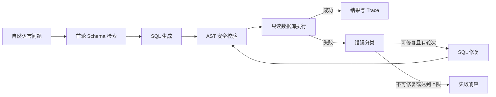

# Chain-NL2SQL

基于 LangGraph 的链式自纠错 NL2SQL 项目，集成 Schema-RAG、SQL 安全治理和可复现实验评测。

> 项目状态：开发设计与 P0 工程骨架已完成，LangGraph 节点、检索、数据库执行等核心业务逻辑待实现。本文档描述目标架构，不将规划能力表述为已上线功能。

## 项目目标

NL2SQL 的难点不只是让模型生成一条 SQL，而是让生成结果能够安全执行、在失败后可解释地修复，并通过执行准确率证明方案有效。

Chain-NL2SQL 将一次查询拆成受控的 Agent 流程：



## 核心亮点

- **LangGraph 自纠错闭环**：使用显式 State、条件分支和最大轮次控制，而不是黑盒 SQL Agent。
- **Schema-RAG**：首次检索后固定 `schema_context` 和 `schema_version`，修复阶段不重复检索，避免 Schema 漂移。
- **安全执行**：基于 `sqlglot` AST 的只读策略、专用只读数据库账号、超时取消、表/字段白名单与结果脱敏。
- **错误治理**：内部原始异常、持久化 Trace、用户响应三层隔离，避免泄露连接串、路径、堆栈和敏感数据。
- **可评测性**：通过 CSpider/Spider 的 EX Accuracy、修复成功率、平均轮次和失败分类，对比单轮 NL2SQL 基线。

## 开发阶段

| 阶段 | 范围 | 验收结果 |
| --- | --- | --- |
| P0 | LangGraph 主链路、固定 SQLite Demo、基础 Schema 读取、SQL 安全校验、FastAPI、日志与测试 | 完成成功查询、SQL 修复、安全拦截和受控失败 |
| P1 | ChromaDB + BM25 混合检索、Reranker、MySQL、评测与基线对照 | 可重复输出 EX、轮次、延迟和失败分类 |
| P2 | Human-in-the-Loop、Example-RAG、Vue3 + Element Plus 前端 | 可审批 SQL、展示完整链路并支持 Few-shot 示例 |

## 技术栈

| 模块 | 组件 |
| --- | --- |
| Agent 编排 | LangGraph、LangChain |
| LLM | DeepSeek-Coder、Qwen2-7B-Instruct、GPT-4o-mini（OpenAI 兼容接口） |
| 检索 | ChromaDB、BGE-small-zh、BM25、bge-reranker-small |
| SQL 安全 | sqlglot、SQLite 只读 URI、MySQL 只读账号 |
| 服务与类型 | FastAPI、Pydantic v2、Uvicorn |
| 前端 | Vue 3、TypeScript、Vite、Tailwind CSS、Element Plus、Pinia |
| 评测 | datasets、CSpider、Spider |
| 测试 | pytest、httpx、可编排 `fake_llm` |

## 模块边界

```text
app/
├── api/             # 路由、认证/权限、响应映射
├── config/          # 配置读取和启动校验
├── graph/           # State、节点、路由和 Graph 构建
├── llm/             # 模型适配、Prompt、输出解析和重试
├── rag/             # 元数据、索引、检索和重排
├── db/              # 适配器、连接、SQL 策略和结果格式化
├── errors/          # 分类和脱敏
└── observability/   # Trace、日志和指标

evals/               # 基线、批量评测和报告
tests/               # 单元、集成和 fake LLM
data/                # SQLite Demo、Schema 快照和 fixtures
web/                 # P2 前端
```

模块之间通过稳定接口通信：Graph 依赖检索、模型和数据库抽象，不直接依赖具体 SDK 或驱动实现。完整职责拆分见下方开发文档。

## 开发文档

- [项目说明文档](docs/项目说明文档.md)：架构、状态定义、节点路由、API、RAG、安全、评测、目录与测试策略。

## 安全边界

- P0 仅面向本机开发环境，服务绑定 `127.0.0.1`。
- 默认不在 API 响应中返回 SQL；P1 仅允许具备认证和调试角色的调用方查看脱敏 SQL。
- 仅执行通过 AST 校验的单条只读查询，拒绝写入、DDL、多语句和危险系统操作。
- 结果受表/字段白名单、字段掩码和可选行级过滤约束。
- 数据库和模型的真实密钥只通过 `.env` 注入，不提交到仓库。

## 计划产物

- 可运行的 SQLite NL2SQL Demo 与固定测试数据。
- `/api/v1/query` 查询接口、健康检查和受控 Trace。
- 单轮基线与链式自纠错方案的评测报告。
- P2 的审批流、Example-RAG 和可视化链路页面。

详细实现规范、接口约束和验收标准请阅读：[docs/项目说明文档.md](docs/项目说明文档.md)。
