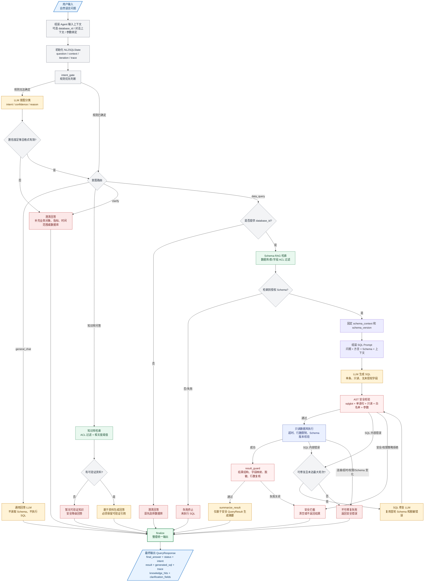
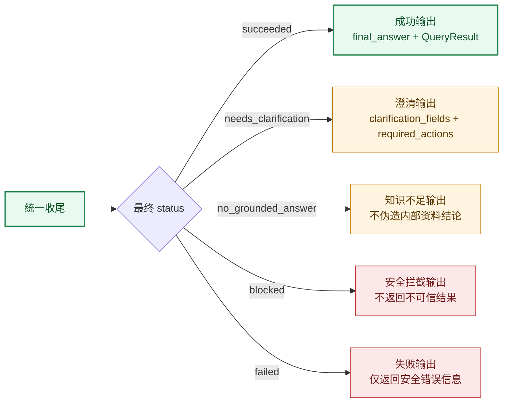

# Agent 输入到输出完整流程图

本文只描述 Agent 从输入到输出的处理链路。登录、HTTP 路由、会话持久化等外围基础设施不放入主图；它们只通过输入上下文和 SSE 结果承载影响 Agent 的行为。

## 1. 输入到输出主流程



主链路中的 SQL 自纠错回环是：

```text
生成 SQL -> 安全校验 -> 只读执行 -> 错误判断
                         -> 可修复且有剩余轮次 -> 修复 SQL -> 安全校验
                         -> 不可修复或达到上限 -> 安全失败
```

修复阶段只处理语法、未知字段、未知表、Join 和聚合等 SQL 内容错误；安全、权限、连接、超时、Schema 变化和结果复核失败不会交给模型绕过。

## 2. 输出状态



## 3. 输入与输出字段

| 阶段 | 字段 | 说明 |
| --- | --- | --- |
| 输入 | `question` | 用户自然语言问题 |
| 输入 | `database_id` | 可选数据库标识；数据查询缺失时进入澄清 |
| 输入 | `conversation_context` | 可选历史对话，用于理解省略主语和指代 |
| 输入 | `bound_parameters` | 可选参数绑定，进入 SQL 安全校验和执行 |
| 中间状态 | `intent` / `intent_confidence` | 意图、置信度和分类来源 |
| 中间状态 | `schema_context` / `schema_version` | 授权 Schema 上下文及版本指纹 |
| 中间状态 | `generated_sql` / `validated_sql` | 模型 SQL 和通过安全校验的 SQL |
| 中间状态 | `query_result` | 经过执行和 `result_guard` 复核的结构化结果 |
| 输出 | `final_answer` | 通用回答、澄清、知识库回答或结果摘要 |
| 输出 | `status` | `succeeded`、`needs_clarification`、`no_grounded_answer`、`blocked` 或 `failed` |
| 输出 | `result` / `generated_sql` | 安全结果和 SQL（按接口策略返回） |
| 输出 | `trace` / `knowledge_hits` | 执行轨迹和知识资料命中来源 |

SSE 只负责把 Agent 节点进度和最终结果传给客户端：`start -> progress... -> complete`；发生异常时发送脱敏的 `error`，不改变上述 Agent 输出语义。
