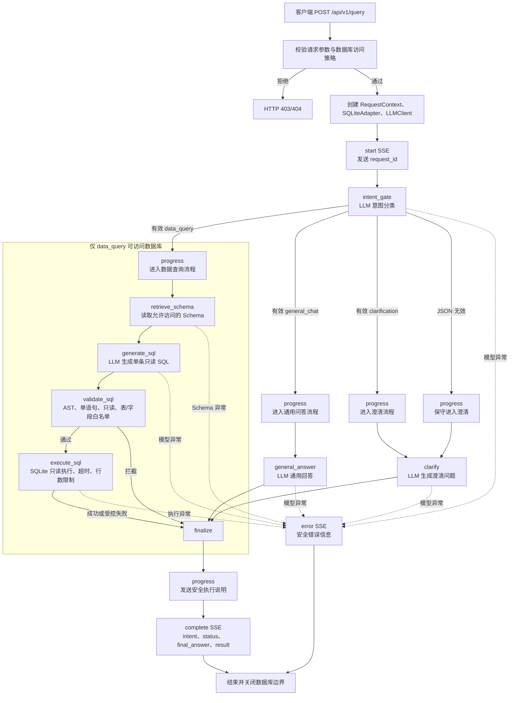

# LangGraph 查询链路实现说明

## 1. 实现概览

当前 `POST /api/v1/query` 已接入一个可运行的 LangGraph Agent。请求不会直接进入 NL2SQL，而是先由 `intent_gate` 调用大模型判断用户意图：

- `data_query`：明确需要本地业务数据，进入 Schema 检索、SQL 生成、安全校验和只读执行。
- `general_chat`：不需要本地数据库，例如问候、天气或邮件写作，交给通用问答节点回答。
- `clarification`：可能与数据有关但缺少对象、指标、时间范围或筛选条件，交给澄清节点追问。

只有意图严格判定为 `data_query` 时才允许访问 Schema 和数据库。意图 JSON 无效时保守进入 `clarification`，不会访问数据库。

真实模型仍需要在 `.env` 中配置 OpenAI 兼容服务：

```dotenv
OPENAI_API_KEY=
OPENAI_BASE_URL=
OPENAI_MODEL=
```

## 2. 完整流程图

下面的流程包含 API、Agent、数据库边界和 SSE 输出。虚线表示条件路由，粗体边界表示只有数据查询分支可以进入的数据库访问区域。



## 3. Graph 节点与路由

[`app/graph/builder.py`](../app/graph/builder.py) 中的 `build_query_graph` 创建并编译以下图：

```text
intent_gate
  ├─ data_query     -> retrieve_schema -> generate_sql -> validate_sql -> execute_sql -> finalize -> END
  ├─ general_chat   -> general_answer -> finalize -> END
  └─ clarification  -> clarify -> finalize -> END
```

| 节点 | 实现 | 作用 | 数据库访问 |
| --- | --- | --- | --- |
| `intent_gate` | `make_intent_gate_node` | 使用无 Schema Prompt 将问题分类为三种意图 | 否 |
| `retrieve_schema` | `SQLiteSchemaRetriever` | 读取表、字段、主外键和 Schema 版本指纹 | 是，仅 `data_query` |
| `generate_sql` | `make_generation_node` | 基于固定 Schema 生成单条只读 SQL | 否 |
| `validate_sql` | `make_validation_node` | 执行 SQL AST、安全、表和字段白名单校验 | 否 |
| `execute_sql` | `make_execution_node` | 只读连接、参数绑定、超时中断和结果格式化 | 是，仅 `data_query` |
| `general_answer` | `make_general_answer_node` | 回答无需本地数据库的普通问题 | 否 |
| `clarify` | `make_clarification_node` | 询问缺少的对象、指标、时间或筛选条件 | 否 |
| `finalize` | `make_finalize_node` | 保留通用回答/澄清回答，或生成数据查询结果说明 | 否 |

### 3.1 意图分类规则

`intent_gate` 使用 [`app/llm/prompts.py`](../app/llm/prompts.py) 中的分类 Prompt，只要求模型返回严格 JSON：

```json
{"intent":"data_query"}
```

判断标准如下：

| 用户问题 | 意图 | 后续处理 |
| --- | --- | --- |
| `查询用户数量` | `data_query` | 读取 Schema 并生成 SQL |
| `上个月订单总额是多少` | `data_query` | 读取 Schema 并执行只读查询 |
| `你好` | `general_chat` | 通用模型回答，不访问数据库 |
| `今天天气怎么样` | `general_chat` | 通用模型回答，不读取本地数据 |
| `帮我写一封邮件` | `general_chat` | 通用模型生成文本 |
| `帮我看看数据` | `clarification` | 追问查询目标，不访问数据库 |
| `订单情况怎么样` | `clarification` | 追问指标、时间范围或筛选条件 |

模型输出解析失败、字段不完整或意图值不在白名单内时，`intent_gate` 返回 `clarification` 和 `intent_classification_valid=false`。这条保守路径保证未知问题不会误触发数据库访问。

## 4. 状态与响应

[`app/graph/state.py`](../app/graph/state.py) 的 `NL2SQLState` 除请求、轮次和 SQL 字段外，还记录：

- `intent`：`data_query`、`general_chat` 或 `clarification`；
- `intent_classification_valid`：分类 JSON 是否符合契约；
- `final_answer`：通用回答、澄清问题或数据查询结果说明；
- `schema_context`、`generated_sql`、`validated_sql` 和 `query_result`：仅数据查询路径产生。

公共响应 `QueryResponse` 会返回 `intent`，非数据分支的 `result` 和 `generated_sql` 为 `null`：

```json
{
  "request_id": "请求追踪 ID",
  "intent": "data_query",
  "status": "succeeded",
  "iteration": 1,
  "error_category": null,
  "final_answer": "查询完成，共返回 1 行结果。",
  "result": {
    "columns": ["user_count"],
    "rows": [[3]],
    "row_count": 1,
    "truncated": false
  },
  "generated_sql": "SELECT COUNT(*) AS user_count FROM users",
  "trace": []
}
```

## 5. SSE 输出

`POST /api/v1/query` 返回 `text/event-stream`，响应事件为：

1. `start`：发送 `request_id`。
2. `progress`：发送节点、状态、意图、面向用户的安全解释和必要的处理摘要。
3. `complete`：发送最终 `QueryResponse`。
4. `error`：模型、Schema 或执行阶段出现未处理异常时发送安全错误。

### 数据查询示例

```text
event: start
data: {"request_id":"..."}

event: progress
data: {"node":"intent_gate","intent":"data_query","message":"正在理解问题并判断处理方式"}

event: progress
data: {"node":"retrieve_schema","retrieved_document_count":4}

event: progress
data: {"node":"generate_sql","sql":"SELECT COUNT(*) AS user_count FROM users"}

event: progress
data: {"node":"validate_sql","validated":true}

event: progress
data: {"node":"execute_sql","row_count":1}

event: complete
data: {"intent":"data_query","status":"succeeded","result":{...}}
```

### 非数据查询示例

```text
event: progress
data: {"node":"intent_gate","intent":"general_chat"}

event: progress
data: {"node":"general_answer","explanation":"使用通用问答模型回答，不读取 Schema 或访问数据库。"}

event: complete
data: {"intent":"general_chat","status":"succeeded","result":null,"generated_sql":null}
```

前端 [`web/src/api/client.ts`](../web/src/api/client.ts) 使用 `fetch` 读取 POST SSE 流；[`web/src/views/QueryView.vue`](../web/src/views/QueryView.vue) 实时展示 Agent 当前步骤。只有 `intent=data_query` 时展示数据库、结果表和 SQL 相关信息，通用回答和澄清仅展示回答内容及意图标签。

## 6. API 与资源边界

[`app/api/routes.py`](../app/api/routes.py) 在创建 Graph 前执行：

1. 校验问题、数据库 ID 和最大轮次。
2. 根据请求上下文检查服务端数据库白名单。
3. 当前仅为 `demo` 创建 `SQLiteAdapter`。
4. 延迟创建 OpenAI 兼容 LLM 客户端。
5. 创建初始 `NL2SQLState` 并返回异步 Graph SSE 流。
6. 在流结束或异常后关闭数据库适配器。

非数据分支虽然仍会调用大模型，但不会把 Schema、数据库路径或数据库结果放入 Prompt。数据库连接对象只作为 Graph 依赖存在，实际 Schema 和执行方法不会被分支调用。

## 7. 错误处理

| 场景 | 处理 |
| --- | --- |
| 数据库不在访问策略中 | HTTP `403` |
| 数据库允许但没有适配器 | HTTP `404` |
| 模型密钥或模型名称缺失 | HTTP `503` |
| 意图分类 JSON 无效 | 进入 `clarification`，不访问数据库 |
| 模型调用失败 | SSE `error`，返回安全错误说明 |
| Schema 读取或 SQL 执行异常 | SSE `error`；不泄漏原始连接信息 |
| SQL 安全策略拒绝 | Graph 状态为 `blocked`，通过 `complete` 返回受控结果 |

## 8. 测试与验证

测试使用可按顺序返回响应的 `FakeLLM`，并使用拒绝数据库访问的替身验证路由边界。

覆盖内容：

- 数据查询：验证意图分类后读取 Schema、生成 SQL、校验并执行成功；
- 通用问题：验证 `你好`、`今天天气怎么样`、`帮我写一封邮件` 只调用分类和通用回答模型，不访问 Schema 或数据库；
- 模糊数据问题：验证澄清回答且不访问数据库；
- 非法分类 JSON：验证保守进入澄清分支；
- SSE 数据路径：验证 `start → progress → complete` 和数据节点顺序；
- SSE 通用/澄清路径：验证不出现 `retrieve_schema`、`generate_sql`、`validate_sql`、`execute_sql`；
- SSE 模型异常：验证输出 `error` 事件；
- 前端构建：验证 SSE 客户端和意图标签可以完成生产构建。

运行后端测试：

```powershell
.\.venv\Scripts\python.exe -m pytest -q
```

运行前端构建：

```powershell
node node_modules/vite/bin/vite.js build
```

当前验证结果：后端 `36 passed`，前端 Vite 生产构建通过。

## 9. 当前边界与后续工作

- 当前按单条用户消息进行意图判断，尚未把多轮聊天历史传入分类和回答 Prompt；因此“那上个月呢”这类追问需要后续补充上下文能力。
- 当前 `data_query` 仍是一次生成、一次校验、一次执行；SQL 执行失败后的自动修复循环尚未接入。
- `SQLiteSchemaRetriever` 直接返回完整 Schema，尚未按问题实现 RAG 筛选、混合检索和重排。
- 当前只支持 `demo` SQLite 数据库，尚未根据数据库 ID 编排 MySQL 或其他适配器。
- `trace` 仍是预留字段；SSE 已提供实时进度，但尚未将完整节点耗时持久化为 TraceEvent。
- 通用问答模型不具备实时天气或外部系统访问能力，不应将其回答解释为实时事实查询。
