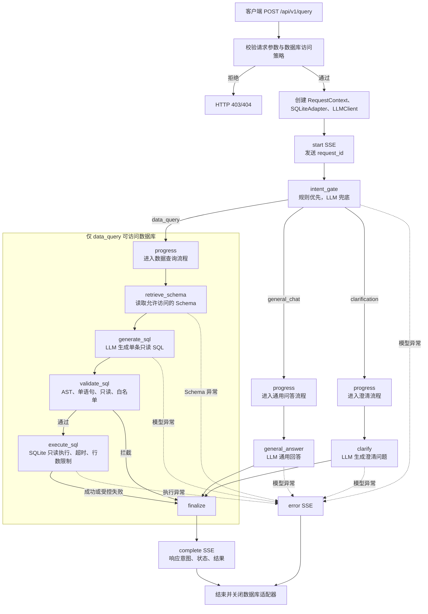

# LangGraph 查询链路实现说明

## 1. 实现概览

当前 `POST /api/v1/query` 接入一个可运行的 LangGraph 工作流。请求先经过数据库访问策略和意图闸门，再按意图选择后续分支：

- `data_query`：明确需要本地业务数据，进入 Schema 读取、SQL 生成、安全校验和只读执行。
- `general_chat`：不需要本地数据库，例如问候、常识、写作或代码辅助，交给通用问答节点。
- `clarification`：疑似数据问题但缺少对象、指标、时间范围或筛选条件，交给澄清节点追问。

意图闸门采用“规则优先 + LLM 兜底”：高置信度、数据库无关的规则直接分类；规则无法安全判断时才调用 LLM。LLM 必须返回包含 `intent`、`confidence`、`reason` 的严格 JSON，默认置信度阈值为 `INTENT_CONFIDENCE_THRESHOLD=0.75`。非法输出或低于阈值时保守进入 `clarification`，因此不会访问 Schema 或数据库。

只有最终意图为 `data_query` 时才允许进入数据查询分支。真实模型需要在 `.env` 中配置 OpenAI 兼容服务：

```dotenv
OPENAI_API_KEY=
OPENAI_BASE_URL=
OPENAI_MODEL=
INTENT_CONFIDENCE_THRESHOLD=0.75
```

## 2. 完整流程图



## 3. Graph 节点与路由

[`app/graph/builder.py`](../app/graph/builder.py) 中的 `build_query_graph` 创建并编译以下图：

```text
intent_gate
  ├─ data_query     -> retrieve_schema -> generate_sql -> validate_sql -> execute_sql -> finalize -> END
  ├─ general_chat   -> general_answer -> finalize -> END
  └─ clarification  -> clarify -> finalize -> END
```

| 节点 | 实现 | 作用 | 数据库/Schema 访问 |
| --- | --- | --- | --- |
| `intent_gate` | `make_intent_gate_node` | 规则优先，必要时调用无 Schema Prompt 将问题分类为三种意图 | 否 |
| `retrieve_schema` | `SQLiteSchemaRetriever` | 读取允许访问的表、字段、主外键和 Schema 版本指纹 | 是，仅 `data_query` |
| `generate_sql` | `make_generation_node` | 基于固定 Schema 生成单条只读 SQL | 否 |
| `validate_sql` | `make_validation_node` | 执行 SQL AST、安全、表和字段白名单校验 | 否 |
| `execute_sql` | `make_execution_node` | 只读连接、参数绑定、超时中断和结果格式化 | 是，仅 `data_query` |
| `general_answer` | `make_general_answer_node` | 回答无需本地数据库的普通问题 | 否 |
| `clarify` | `make_clarification_node` | 询问缺少的对象、指标、时间或筛选条件 | 否 |
| `finalize` | `make_finalize_node` | 整理回答、查询结果或受控错误 | 否 |

### 3.1 意图分类规则与 LLM 契约

规则实现位于 [`app/graph/intent_rules.py`](../app/graph/intent_rules.py)，只使用问题文本中的高精度表达，不读取 Schema。明确命中规则时返回 `intent_source=rule`，避免不必要的模型调用；否则调用 [`app/llm/prompts.py`](../app/llm/prompts.py) 中的分类 Prompt，返回格式必须为：

```json
{
  "intent": "data_query|general_chat|clarification",
  "confidence": 0.0,
  "reason": "简短判断理由"
}
```

闸门会把来源记录为 `rule` 或 `llm`，并保留置信度和理由。LLM 输出必须是合法 JSON、只包含上述三个字段、标签属于白名单、置信度在 `[0, 1]`；否则或置信度低于阈值时返回 `clarification`，并设置 `intent_classification_valid=false`。模型调用异常由 API 流转换为安全的 `error` SSE，不会降级为数据库查询。

| 用户问题 | 意图 | 后续处理 |
| --- | --- | --- |
| `查询用户数量` | `data_query` | 读取 Schema 并生成 SQL |
| `上个月订单总额是多少` | `data_query` | 读取 Schema 并执行只读查询 |
| `你好` | `general_chat` | 通用模型回答，不访问数据库 |
| `帮我写一封邮件` | `general_chat` | 通用模型生成文本 |
| `帮我看看数据` | `clarification` | 追问查询目标，不访问数据库 |
| `订单情况怎么样？` | `clarification` | 追问指标、时间范围或筛选条件 |

### 3.2 数据查询链路

`retrieve_schema` 当前通过 `SQLiteSchemaRetriever` 直接读取当前数据库的完整 Schema，并生成版本指纹；尚未按问题做真正的 RAG 筛选。`generate_sql` 只接收问题、方言和 Schema，要求输出一条 `SELECT` 或最终只读的 `WITH` 查询。`validate_sql` 使用 AST 和服务端白名单检查单语句、只读操作、允许表和允许字段；不通过时将状态置为 `blocked`，不会调用执行器。

`execute_sql` 仅执行已校验 SQL，使用只读连接、参数绑定、截止时间进度回调、结果行数上限和敏感字段脱敏。执行失败会写入稳定的错误分类和安全消息。当前 Graph 是“一次生成、一次校验、一次执行”，执行失败后的 SQL 自动修复节点尚未接入。

### 3.3 数据库工具边界

[`app/db/sqlite_adapter.py`](../app/db/sqlite_adapter.py) 是当前 Graph 使用的实际数据库组件，只支持本地 `demo` SQLite。另有 [`app/db/tools.py`](../app/db/tools.py) 提供 LangChain `query_database` `StructuredTool` 适配器，可被模型调用，但当前 Graph 仍固定调用 `DatabaseExecutor`，不是由模型自主选择工具。MySQL 适配器文件存在，但尚未在 API 数据库编排中启用。

## 4. 状态与响应

[`app/graph/state.py`](../app/graph/state.py) 的 `NL2SQLState` 在初始状态中保存请求标识、问题、数据库 ID、方言、轮次、最大轮次、Trace 和运行状态；节点按需追加：

- `intent`：三种受控意图之一；
- `intent_confidence`：规则或 LLM 的置信度；
- `intent_reason`：简短分类理由；
- `intent_source`：`rule` 或 `llm`；
- `intent_classification_valid`：分类输出是否满足契约；
- `schema_context`、`generated_sql`、`validated_sql`、`query_result`：仅数据查询路径产生；
- `error_category`、`safe_error`、`final_answer`：受控错误和最终回答。

公共响应 [`app/schemas/response.py`](../app/schemas/response.py) 会返回意图元数据。非数据分支的 `result` 和 `generated_sql` 为 `null`：

```json
{
  "request_id": "请求追踪 ID",
  "intent": "data_query",
  "intent_confidence": 0.96,
  "intent_reason": "同时包含数据查询动作和业务数据对象",
  "intent_source": "rule",
  "status": "succeeded",
  "iteration": 0,
  "error_category": null,
  "final_answer": "查询完成，共返回 1 行结果。",
  "result": {
    "columns": ["user_count"],
    "rows": [[3]],
    "row_count": 1,
    "truncated": false
  },
  "generated_sql": "SELECT COUNT(*) AS user_count FROM users",
  "trace": []
}
```

## 5. SSE 输出

`POST /api/v1/query` 返回 `text/event-stream`。事件顺序通常为 `start`、多个 `progress`、最终 `complete`；未处理的模型、Schema 或执行异常返回 `error`。`progress` 会带节点名、状态、轮次、面向用户的解释；`intent_gate` 额外带 `intent`、`classification_valid`、`confidence`、`source` 和 `reason`。

### 数据查询示例

```text
event: start
data: {"request_id":"..."}

event: progress
data: {"node":"intent_gate","intent":"data_query","classification_valid":true,"confidence":0.96,"source":"rule","reason":"同时包含数据查询动作和业务数据对象"}

event: progress
data: {"node":"retrieve_schema","retrieved_document_count":4,"tables":["users","orders"]}

event: progress
data: {"node":"generate_sql","sql":"SELECT COUNT(*) AS user_count FROM users"}

event: progress
data: {"node":"validate_sql","validated":true}

event: progress
data: {"node":"execute_sql","row_count":1}

event: complete
data: {"intent":"data_query","status":"succeeded","result":{}}
```

### 非数据查询示例

```text
event: progress
data: {"node":"intent_gate","intent":"general_chat","classification_valid":true,"confidence":0.98,"source":"rule"}

event: progress
data: {"node":"general_answer","explanation":"使用通用问答模型回答，不读取 Schema 或访问数据库。"}

event: complete
data: {"intent":"general_chat","status":"succeeded","result":null,"generated_sql":null}
```

前端 [`web/src/api/client.ts`](../web/src/api/client.ts) 使用 `fetch` 读取 POST SSE 流；[`web/src/views/QueryView.vue`](../web/src/views/QueryView.vue) 实时展示 Agent 当前步骤。只有 `intent=data_query` 时展示数据库、结果表和 SQL 相关信息，通用回答和澄清仅展示回答内容及意图标签。

## 6. API 与资源边界

[`app/api/routes.py`](../app/api/routes.py) 在创建 Graph 前执行：

1. 校验 `question`、`database_id` 和可选的 `max_iterations`（请求长度和范围由 Pydantic 约束）。
2. 根据请求上下文检查服务端数据库白名单。
3. 当前仅为 `demo` 创建 `SQLiteAdapter`；其他允许 ID 尚无 API 适配器时返回 `404`。
4. 延迟创建 OpenAI 兼容 LLM 客户端；未配置时返回 `503`。
5. 创建初始 `NL2SQLState` 并返回异步 Graph SSE 流。
6. 在流结束或异常后关闭数据库适配器。

非数据分支虽然可能调用通用 LLM，但不会把 Schema、数据库路径或数据库结果放入 Prompt。数据库连接对象只作为 Graph 依赖存在，实际 Schema 和执行方法不会被这些分支调用。

## 7. 错误处理与安全边界

| 场景 | 处理 |
| --- | --- |
| 数据库不在访问策略中 | HTTP `403` |
| 数据库 ID 为 `demo` 之外且无适配器 | HTTP `404` |
| 模型密钥或模型名称缺失 | HTTP `503` |
| 意图分类 JSON 无效或置信度不足 | `clarification`，不访问数据库 |
| 流内模型调用失败 | SSE `error`，返回安全错误说明 |
| Schema 读取或 SQL 执行异常 | SSE `error` 或受控失败状态；不泄漏连接信息 |
| SQL 安全策略拒绝 | 状态为 `blocked`，通过 `complete` 返回受控结果 |

SQL 执行前还会进行单语句、只读、表/字段白名单和 AST 检查；执行使用只读连接、超时、行数限制、参数绑定及结果脱敏。原始异常不会写入公共响应。

## 8. 意图分类准确率评测

为规则和 LLM 兜底分类建立了可重复的 50 条固定标注集：

- 数据集：[`evals/intent_dataset.jsonl`](../evals/intent_dataset.jsonl)，包含 20 条 `data_query`、15 条 `general_chat`、15 条 `clarification`，每条记录含问题、标签、类别和标注理由。
- 脚本：[`scripts/evaluate_intent.py`](../scripts/evaluate_intent.py)，复用生产 `intent_gate`，规则命中不调用 LLM，边界样例才调用真实 LLM。
- 输出：[`evals/reports/intent_accuracy.json`](../evals/reports/intent_accuracy.json) 和 [`evals/reports/intent_accuracy.md`](../evals/reports/intent_accuracy.md)。运行时默认关闭 LangSmith 网络追踪。

脚本输出总体准确率、每类 precision/recall/F1、混淆矩阵、规则命中率、LLM 兜底率、非法/低置信度数量、平均延迟、LLM 调用次数和 `data_query` 误触数据库比例，并列出失败样例。默认阈值为 `0.75`，可用 `--threshold` 覆盖。

当前一次基准报告（模型服务期间有 1 次供应商 `503 No available channel`）为：

| 指标 | 结果 |
| --- | ---: |
| 总体准确率 | **98.00%（49/50）** |
| 排除供应商错误后的完成准确率 | **100.00%** |
| `data_query` 误触数据库比例 | **0.00%** |
| 规则命中率 | **98.00%** |
| LLM 兜底率 | **2.00%** |
| LLM 调用次数 | 1 |
| 平均延迟 | 33.78 ms |
| 澄清类召回率 | 93.33% |

其中唯一未完成样例为 `业务表现怎么样？`，原因是 LLM 供应商暂时无可用通道，并非已确认的模型误分类。模型服务恢复后应重新运行评测，并比较总体准确率、澄清类召回率、误触数据库比例和 LLM 调用次数。

运行方式：

```powershell
.\.venv\Scripts\python.exe scripts/evaluate_intent.py
.\.venv\Scripts\python.exe scripts/evaluate_intent.py --threshold 0.80
```

## 9. 测试与验证

测试使用可按顺序返回响应的 `FakeLLM`，并使用拒绝数据库访问的替身验证路由边界，覆盖：

- 明确数据查询进入 Schema、SQL 生成、校验和执行；
- 明确通用问题只调用分类和通用回答，不访问 Schema 或数据库；
- 模糊数据问题进入澄清，不访问数据库；
- 规则命中时不调用 LLM；
- 非法 JSON、未知标签、字段缺失和低置信度返回澄清；
- SSE 数据、通用、澄清和错误事件顺序及内容；
- 50 条评测集的样例数量、类别计数、指标和报告可序列化。

运行后端测试：

```powershell
.\.venv\Scripts\python.exe -m pytest -q
```

当前后端测试基线为 **42 passed**。前端生产构建命令为：

```powershell
node node_modules/vite/bin/vite.js build
```

前端构建需在本地依赖完整时单独验证；本说明不把未实际运行的构建结果标记为通过。

## 10. 当前边界与后续工作

- 当前按单条用户消息进行意图判断，尚未把多轮聊天历史传入分类和回答 Prompt；“那上个月呢”需要后续上下文能力。
- 当前 `data_query` 是一次生成、一次校验、一次执行；`app/graph/repair_node.py` 仍是空壳，SQL 执行失败后的自动修复闭环尚未接入。
- `SQLiteSchemaRetriever` 直接返回完整 Schema，尚未按问题实现真正的 RAG 筛选、混合检索和重排；相关 `app/rag` 模块不代表该 Graph 已完成接线。
- 当前 API 只编排本地 `demo` SQLite；MySQL 等其他数据库适配器尚未接入数据库 ID 路由。
- [`app/db/tools.py`](../app/db/tools.py) 的 LangChain `query_database` 工具可独立创建，但 Graph 当前不采用模型自主工具调用。
- `trace` 是预留的可展示节点摘要字段；SSE 有实时进度，但完整节点耗时尚未持久化为 TraceEvent。
- 通用问答模型不具备实时天气或外部系统访问能力，不应把通用回答解释为实时事实查询。
- 意图评测集是可重复基准，不代表生产流量分布；生产上线前仍需扩展多轮、否定表达、同音词、领域术语和对抗输入样例。
