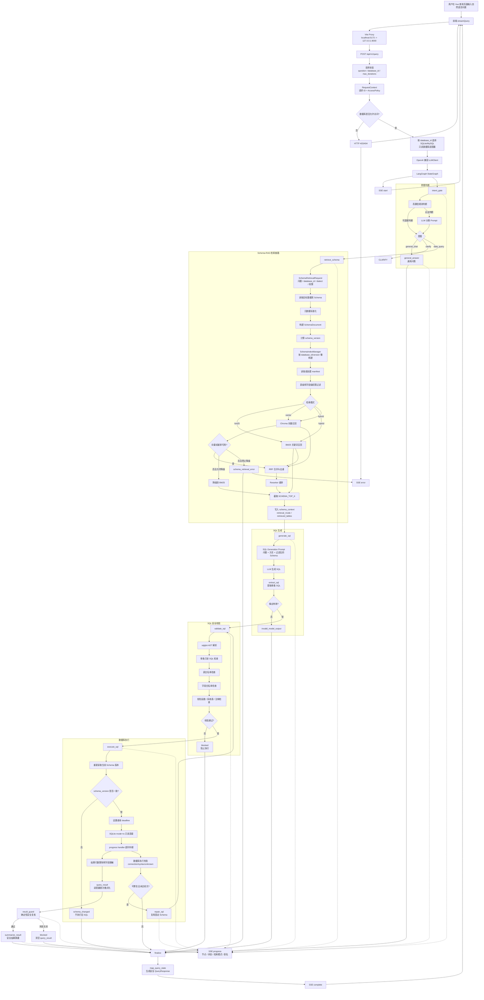

# LangGraph 查询链路实现说明

## 1. 实现概览

当前 `POST /api/v1/query` 以及会话查询接口接入同一套可运行的 LangGraph 工作流。请求先经过数据库访问策略和意图闸门，再按意图选择后续分支：

- `data_query`：明确需要本地业务数据，进入 Schema 读取、SQL 生成、安全校验和只读执行。
- `general_chat`：不需要本地数据库，例如问候、常识、写作或代码辅助，交给通用问答节点；
- `clarify`：意图不明确、字段缺失或数据库未选择时，返回澄清要求，不访问数据库。

当通用问题的 `knowledge_policy=required` 时，Graph 会进入 `retrieve_knowledge -> grounded_answer`，只使用当前用户有权访问的业务知识片段回答，并返回受控来源；普通通用回答和数据查询不会无条件读取知识库。知识库检索异常不会把未授权内容送入模型，普通数据查询仍可继续进入 Schema-RAG。

意图闸门采用“规则优先 + LLM 兜底”：高置信度、数据库无关的规则直接分类；规则无法安全判断时才调用 LLM。LLM 必须返回包含 `intent`、`confidence`、`reason` 的严格 JSON，默认置信度阈值为 `INTENT_CONFIDENCE_THRESHOLD=0.75`。非法输出或低于阈值时进入 `clarify`，因此不会访问 Schema 或数据库。

只有最终意图为 `data_query` 时才允许进入数据查询分支。真实模型需要在 `.env` 中配置 OpenAI 兼容服务：

```dotenv
OPENAI_API_KEY=
OPENAI_BASE_URL=
OPENAI_MODEL=
INTENT_CONFIDENCE_THRESHOLD=0.75
RESULT_ROW_LIMIT=100
RESULT_SUMMARY_ENABLED=true
RESULT_SUMMARY_MAX_CHARS=12000
```

`RESULT_SUMMARY_ENABLED=false` 时跳过摘要模型，仍返回安全 `QueryResult` 和确定性 `final_answer`。`RESULT_SUMMARY_MAX_CHARS` 同时限制传入摘要模型的稳定 JSON 和模型输出；超限直接降级，不影响查询成功状态。

## 2. 目录与职责

```text
app/
├── api/
│   ├── routes.py             # FastAPI 查询入口、SSE 事件、数据库管理和资源边界
│   ├── dependencies.py       # RequestContext、请求 ID 和访问策略注入
│   ├── auth.py               # 登录身份和管理员权限依赖
│   ├── authorization.py      # 数据库、表和字段访问策略模型
│   └── response_mapper.py    # Graph State 到安全响应模型的映射
├── auth/
│   └── repository.py         # 账号、角色、会话 Cookie 和成员状态持久化
├── conversations/
│   └── repository.py         # 分析会话、消息、SSE 进度和结果快照持久化
├── config/
│   ├── settings.py           # 环境变量和运行时配置
│   └── validation.py         # 配置合法性校验
├── schemas/
│   ├── request.py            # HTTP 请求模型
│   ├── response.py           # HTTP/SSE 响应模型
│   └── domain.py             # Graph、Schema 和结果领域模型
├── graph/
│   ├── builder.py            # StateGraph 构建、节点注册和条件路由
│   ├── state.py              # NL2SQLState 与初始状态
│   ├── routes.py             # Graph 条件路由辅助函数
│   ├── intent_node.py        # 规则优先、LLM 兜底的意图分类
│   ├── intent_rules.py       # 不访问数据库的高置信规则判断
│   ├── generation_node.py    # 根据检索到的 Schema 生成只读 SQL
│   ├── validation_node.py    # SQL AST、安全策略和白名单校验
│   ├── execution_node.py     # 受限数据库查询执行和 Schema 漂移检查
│   ├── general_answer_node.py # 非数据库问题的通用回答
│   ├── result_guard_node.py   # 执行后确定性结果安全复核
│   ├── result_summary_node.py # 基于安全结果生成自然语言摘要
│   ├── finalize_node.py       # 统一生成最终状态和用户说明
│   └── repair_node.py        # 有限错误类别的 SQL 自动修复节点
├── rag/
│   ├── introspector.py       # SQLite/MySQL 元数据读取
│   ├── normalizer.py         # 不同数据库元数据标准化
│   ├── document_builder.py   # SchemaDocument 构建
│   ├── index_manager.py      # 索引版本、构建和受控重建
│   ├── vector_store.py       # Chroma 向量索引读写
│   ├── bm25_store.py         # BM25 索引读写
│   ├── hybrid_retriever.py   # 混合召回与去重
│   ├── reranker.py           # 候选结果重排
│   └── retriever.py          # SchemaRetriever 协议和兼容读取器
├── llm/
│   ├── client.py             # LLMClient 协议和 ModelResponse
│   ├── factory.py            # OpenAI 兼容 ChatModel 适配
│   ├── prompts.py            # 意图、SQL 和通用回答 Prompt
│   ├── output_parser.py      # 模型 SQL 输出提取
│   └── retry_policy.py       # LLM 超时和有限重试
├── db/
│   ├── base.py               # DatabaseExecutor 协议和执行错误
│   ├── sqlite_adapter.py     # Demo SQLite 只读适配器
│   ├── mysql_adapter.py      # MySQL 只读适配器和 Schema 读取
│   ├── registry.py           # 数据库注册和表级 Agent 权限持久化
│   ├── connection_manager.py # 连接生命周期和超时管理
│   ├── result_formatter.py   # 第一层行数限制、截断和结果标准化
│   ├── result_guard.py       # 第二层投影映射、字段脱敏和结果形状复核
│   └── security_policy.py    # SQL AST 只读和访问策略校验
├── errors/
│   ├── categories.py         # 稳定业务错误类别
│   ├── classifier.py         # 驱动异常到业务错误分类
│   └── redactor.py           # 错误、连接信息和 SQL 脱敏
├── observability/
│   ├── logging.py            # 结构化服务端日志
│   ├── metrics.py            # 查询和修复指标
│   └── trace.py              # 节点级 TraceEvent
└── tool/
    └── database_query.py     # 可独立创建的数据库查询工具，当前 Graph 不自动调用

tests/
├── unit/test_graph.py        # Graph 节点和意图分支测试
├── unit/test_sse.py          # SSE 事件顺序和响应测试
├── unit/test_database_registry.py # 数据库注册、表同步和权限测试
├── unit/test_database_tool.py # 独立数据库查询工具测试
├── unit/test_schema_rag.py    # Schema-RAG 检索和索引测试
└── fakes/fake_llm.py         # 离线模型替身

web/src/
├── api/client.ts             # 后端 HTTP/SSE 客户端
├── types/api.ts              # 前端 API 和 SSE 类型
├── composables/agentConversations.ts # 会话列表、消息和 SSE 状态
├── views/AgentView.vue        # Agent 查询聊天界面和流式进度展示
└── views/DatabasesView.vue    # 数据库配置、连接测试和表权限开关
```

该目录说明只描述当前代码职责。Schema-RAG 已通过 `SchemaIndexManager` 接入查询 Graph，`repair_node.py` 已接入有限错误类别修复；MySQL 适配器、数据库注册、表级 Agent 权限和数据库管理页面均已实现。`database_query.py` 是可独立创建的只读工具，但当前 Graph 不自动调用。

数据库管理边界如下：

- `DatabaseRegistry` 只保存非敏感连接元数据和服务端凭据引用，不保存明文密码。
- 管理员测试连接成功后，服务端读取并同步目标数据库的表清单；新同步的数据表默认 `agent_access=false`。
- 只有显式开启 Agent 权限的表才会进入 Schema 检索、SQL 校验和执行策略；默认关闭可避免新表被意外暴露。
- MySQL 密码仅通过服务端环境变量按 `credential_ref` 读取，密码、连接串和驱动原始异常不会写入 API 响应或本文档。

## 3. 完整流程图



## 4. Graph 节点与路由

[`app/graph/builder.py`](../app/graph/builder.py) 中的 `build_query_graph` 创建并编译以下图：

```text
intent_gate
  ├─ data_query     -> retrieve_schema -> generate_sql -> validate_sql -> execute_sql
  │                  -> result_guard -> summarize_result -> finalize -> END
  │                  -> repair_sql（可修复错误且未达轮次） -> validate_sql
  ├─ general_chat   -> general_answer -> finalize -> END
  ├─ grounded_chat  -> retrieve_knowledge -> grounded_answer -> finalize -> END
  └─ clarify        -> clarification_answer -> finalize -> END
```

| 节点 | 实现 | 作用 | 数据库/Schema 访问 |
| --- | --- | --- | --- |
| `intent_gate` | [`intent_node.py`](../app/graph/intent_node.py) | 规则优先，必要时调用无 Schema Prompt 将问题分类为 `data_query`、`general_chat` 或 `clarify` | 否 |
| `retrieve_schema` | [`index_manager.py`](../app/rag/index_manager.py) 中的 `SchemaIndexManager` | 按问题检索允许访问的 Schema，返回版本、模式和召回摘要 | 是，仅 `data_query` |
| `generate_sql` | [`generation_node.py`](../app/graph/generation_node.py) | 基于固定 Schema 生成单条只读 SQL | 否 |
| `validate_sql` | [`validation_node.py`](../app/graph/validation_node.py) | 执行 SQL AST、安全、表和字段白名单校验 | 否 |
| `execute_sql` | [`execution_node.py`](../app/graph/execution_node.py) | 只读连接、参数绑定、超时中断和结果格式化 | 是，仅 `data_query` |
| `result_guard` | [`result_guard_node.py`](../app/graph/result_guard_node.py) | 不调用 LLM，复核结果形状、行数上限、SQL 投影与字段权限；对直接列、别名和表达式统一脱敏，无法证明安全时失败关闭 | 否；读取已执行 SQL 和结果 |
| `summarize_result` | [`result_summary_node.py`](../app/graph/result_summary_node.py) | 仅把安全复核后的结果交给 LLM 生成 `final_answer`；模型失败时使用确定性回答 | 否 |
| `general_answer` | [`general_answer_node.py`](../app/graph/general_answer_node.py) | 回答无需本地数据库的普通问题 | 否 |
| `retrieve_knowledge` | [`builder.py`](../app/graph/builder.py) | 按当前用户 ACL 检索业务知识片段，写入 `knowledge_hits` 和 `knowledge_context`；失败时保留受控错误 | 仅知识策略要求时 |
| `grounded_answer` | [`grounded_answer_node.py`](../app/graph/grounded_answer_node.py) | 基于授权知识片段生成带来源约束的业务回答；无可靠命中时拒答 | 否 |
| `clarification_answer` | [`clarification_node.py`](../app/graph/clarification_node.py) | 对意图不明确、缺少数据库或查询条件的问题生成澄清响应 | 否 |
| `repair_sql` | [`repair_node.py`](../app/graph/repair_node.py) | 对有限数据库错误复用固定 Schema 生成修复 SQL，并受最大轮次限制 | 否 |
| `finalize` | [`finalize_node.py`](../app/graph/finalize_node.py) | 整理回答、查询结果或受控错误 | 否 |

### 4.1 意图分类规则与 LLM 契约

规则实现位于 [`intent_rules.py`](../app/graph/intent_rules.py)，只使用问题文本中的高精度表达，不读取 Schema。明确命中规则时返回 `intent_source=rule`，避免不必要的模型调用；否则调用 [`prompts.py`](../app/llm/prompts.py) 中的分类 Prompt，返回格式必须为：

```json
{
  "intent": "data_query|general_chat|clarify",
  "confidence": 0.0,
  "reason": "简短判断理由"
}
```

闸门会把来源记录为 `rule` 或 `llm`，并保留置信度和理由。LLM 输出必须是合法 JSON、只包含上述三个字段、标签属于白名单、置信度在 `[0, 1]`；否则或置信度低于阈值时返回 `clarify`，并设置 `intent_classification_valid=false`。模型调用异常由 API 流转换为安全的 `error` SSE，不会降级为数据库查询。

| 用户问题 | 意图 | 后续处理 |
| --- | --- | --- |
| `查询用户数量` | `data_query` | 读取 Schema 并生成 SQL |
| `上个月订单总额是多少` | `data_query` | 读取 Schema 并执行只读查询 |
| `你好` | `general_chat` | 通用模型回答，不访问数据库 |
| `帮我写一封邮件` | `general_chat` | 通用模型生成文本 |
| `帮我看看数据` | `clarify` | 返回缺失字段，不访问数据库 |
| `订单情况怎么样？` | `clarify` | 返回缺失指标或时间范围，不访问数据库 |

### 4.2 数据查询链路

`retrieve_schema` 当前通过 `SchemaIndexManager` 读取已注册数据库的 Schema，按 `SchemaRetrievalRequest` 携带的问题、数据库、方言和表/字段访问策略执行检索。SQLite 和 MySQL 均通过对应的只读适配器提供元数据；默认使用 `hybrid` 模式：BM25 和 Chroma 向量候选使用 RRF 合并去重，可选 Reranker 重排，最终返回 `SCHEMA_TOP_K` 张表。检索索引按 `database_id/schema_version` 懒构建并持久化；向量或重排依赖不可用时默认降级为 BM25，无法使用 BM25 时返回 `schema_retrieval_error`。

权限过滤在检索前执行。未授权的表和字段不会进入索引 scope、最终 `schema_context` 或 SQL Prompt。`generate_sql` 只接收过滤后的问题、方言和 Schema，要求输出一条 `SELECT` 或最终只读的 `WITH` 查询。`validate_sql` 使用 AST 和服务端白名单检查单语句、只读操作、允许表和允许字段；安全策略违规保持 `blocked`，语法错误可进入有限修复流程。

首次检索得到的 `schema_version` 固定在 State 中。`execute_sql` 执行前重新读取数据库 Schema 指纹；版本变化时返回 `schema_changed`，不执行旧 SQL，也不在同一请求中替换 Schema 上下文。

`execute_sql` 仅执行已校验 SQL，使用只读连接、参数绑定、截止时间进度回调、结果行数上限和适配器层敏感字段脱敏。执行失败会写入稳定的错误分类和安全消息；语法、未知表/字段、连接关系和聚合错误在未超过 `max_iterations` 时进入 `repair_sql`，修复阶段复用首次检索的 Schema，不重复检索。检索为空时直接返回 `schema_retrieval_error`，不会调用 SQL 生成模型。

执行成功后不会直接把结果交给回答模型。`result_guard` 是第二层、确定性的结果安全边界：确认列数与每行字段数一致，重新执行 `RESULT_ROW_LIMIT`，根据 `validated_sql` AST 和 `AccessPolicy` 推导输出列来源，并覆盖别名列、表达式、CTE/派生查询中的敏感字段。配置字段级权限时，`SELECT *` 和 `table.*` 一律拒绝；无法解析投影或无法证明输出字段安全时清空 `query_result`，将状态设为 `blocked`。因此 `QueryResult` 始终是前端表格、结果引用和会话持久化的权威事实源。

`result_guard` 成功且状态为 `succeeded` 后才进入 `summarize_result`。摘要 Prompt 只接收用户问题和安全结果的稳定 JSON（列名、行、`row_count`、`truncated`），把单元格视为不可信数据，不执行其中的指令，不生成 SQL，也不能修改、删除或重排结构化结果。摘要模型超时、异常、空输出、超长或上下文序列化失败时，查询仍保持成功，`final_answer` 回退为“查询完成，共返回 N 行结果”（截断时追加说明），并将 `answer_source` 设为 `deterministic_fallback`；成功摘要为 `result_summary`。通用问答使用 `general_llm`，且不经过结果摘要节点。

### 4.3 数据库工具边界

Graph 通过 `DatabaseExecutor` 协议访问数据库：`demo` 使用 [`sqlite_adapter.py`](../app/db/sqlite_adapter.py)，已注册的 MySQL 数据库使用 [`mysql_adapter.py`](../app/db/mysql_adapter.py)。API 根据 `database_id` 从 [`registry.py`](../app/db/registry.py) 读取非敏感连接配置并选择适配器；MySQL 凭据只通过服务端环境变量中的 `credential_ref` 读取。另有 [`database_query.py`](../app/tool/database_query.py) 提供 LangChain `query_database` `StructuredTool` 适配器，可被独立创建，但当前 Graph 仍固定调用 `DatabaseExecutor`，不是由模型自主选择工具。

## 5. 状态与响应

[`state.py`](../app/graph/state.py) 的 `NL2SQLState` 在初始状态中保存请求标识、问题、数据库 ID、方言、轮次、最大轮次、Trace 和运行状态；节点按需追加：

- `intent`：三种受控意图之一；
- `intent_confidence`：规则或 LLM 的置信度；
- `intent_reason`：简短分类理由；
- `intent_source`：`rule` 或 `llm`；
- `intent_classification_valid`：分类输出是否满足契约；
- `schema_version`：首次 Schema 检索时固定的版本指纹；
- `retrieval_mode`：`bm25`、`vector`、`hybrid` 或兼容路径的 `full_schema`；
- `retrieval_scores`：内部召回分数摘要，不包含原始索引对象；
- `retrieved_tables`：经过权限过滤后返回的表名；
- `schema_context`、`generated_sql`、`validated_sql`、`query_result`：仅数据查询路径产生；
- `error_category`、`safe_error`、`final_answer`：受控错误和最终回答；
- `answer_source`：`general_llm`、`result_summary` 或 `deterministic_fallback`，标识 `final_answer` 的来源。

公共响应 [`app/schemas/response.py`](../app/schemas/response.py) 会返回意图元数据。非数据分支的 `result` 和 `generated_sql` 为 `null`：

```json
{
  "request_id": "请求追踪 ID",
  "intent": "data_query",
  "intent_confidence": 0.96,
  "intent_reason": "同时包含数据查询动作和业务数据对象",
  "intent_source": "rule",
  "status": "succeeded",
  "iteration": 0,
  "error_category": null,
  "answer_source": "result_summary",
  "final_answer": "查询完成，共返回 1 行结果。",
  "result": {
    "columns": ["user_count"],
    "rows": [[3]],
    "row_count": 1,
    "truncated": false
  },
  "generated_sql": "SELECT COUNT(*) AS user_count FROM users",
  "trace": []
}
```

## 6. SSE 输出

[`routes.py`](../app/api/routes.py) 中的 `POST /api/v1/query` 返回 `text/event-stream`。事件顺序通常为 `start`、多个 `progress`、最终 `complete`；未处理的模型、Schema 或执行异常返回 `error`。`progress` 会带节点名、状态、轮次、面向用户的解释；`intent_gate` 额外带 `intent`、`classification_valid`、`confidence`、`source` 和 `reason`；`result_guard` 带 `guarded`，`summarize_result` 带 `answer_source`。

### 数据查询示例

```text
event: start
data: {"request_id":"..."}

event: progress
data: {"node":"intent_gate","intent":"data_query","classification_valid":true,"confidence":0.96,"source":"rule","reason":"同时包含数据查询动作和业务数据对象"}

event: progress
data: {"node":"retrieve_schema","retrieval_mode":"hybrid","retrieved_document_count":2,"tables":["users","orders"]}

event: progress
data: {"node":"generate_sql","sql":"SELECT COUNT(*) AS user_count FROM users"}

event: progress
data: {"node":"validate_sql","validated":true}

event: progress
data: {"node":"execute_sql","row_count":1}

event: progress
data: {"node":"result_guard","status":"succeeded","guarded":true}

event: progress
data: {"node":"summarize_result","status":"succeeded","answer_source":"result_summary"}

event: complete
data: {"intent":"data_query","status":"succeeded","answer_source":"result_summary","result":{}}
```

### 非数据查询示例

```text
event: progress
data: {"node":"intent_gate","intent":"general_chat","classification_valid":true,"confidence":0.98,"source":"rule"}

event: progress
data: {"node":"general_answer","explanation":"使用通用问答模型回答，不读取 Schema 或访问数据库。"}

event: complete
data: {"intent":"general_chat","status":"succeeded","result":null,"generated_sql":null}
```

前端 [`web/src/api/client.ts`](../web/src/api/client.ts) 使用 `fetch` 读取 POST SSE 流；[`web/src/views/AgentView.vue`](../web/src/views/AgentView.vue) 实时展示 Agent 当前步骤，并通过 `agentConversations.ts` 恢复服务端会话。数据库配置、连接测试、Schema 表同步和 Agent 表权限开关由 [`web/src/views/DatabasesView.vue`](../web/src/views/DatabasesView.vue) 提供。只有 `intent=data_query` 时展示数据库、结果表和 SQL 相关信息，通用回答仅展示回答内容及意图标签。

## 7. API 与资源边界

[`routes.py`](../app/api/routes.py) 在创建 Graph 前执行：

1. 校验 `question`、`database_id` 和可选的 `max_iterations`（请求长度和范围由 Pydantic 约束）。
2. 根据请求上下文检查服务端数据库白名单。
3. 根据注册记录的方言创建 `SQLiteAdapter` 或 `MySQLAdapter`；未注册、禁用或不支持的数据库返回受控错误。
4. 延迟创建 OpenAI 兼容 LLM 客户端；未配置时返回 `503`。
5. 创建初始 `NL2SQLState` 并返回异步 Graph SSE 流。
6. 在流结束或异常后关闭数据库适配器。

非数据分支虽然可能调用通用 LLM，但不会把 Schema、数据库路径或数据库结果放入 Prompt。数据库连接对象只作为 Graph 依赖存在，实际 Schema 和执行方法不会被这些分支调用。

## 8. 错误处理与安全边界

| 场景 | 处理 |
| --- | --- |
| 数据库不在访问策略中 | HTTP `403` |
| 数据库未注册、已禁用或无可用适配器 | HTTP `404` |
| 模型密钥或模型名称缺失 | HTTP `503` |
| 意图分类 JSON 无效或置信度不足 | `clarify`，不访问数据库 |
| 流内模型调用失败 | SSE `error`，返回安全错误说明 |
| Schema 读取或 SQL 执行异常 | SSE `error` 或受控失败状态；不泄漏连接信息 |
| SQL 安全策略拒绝 | 状态为 `blocked`，通过 `complete` 返回受控结果 |
| 结果安全复核失败 | `result_guard` 清空 `query_result`，状态为 `blocked`，通过 `complete` 返回安全错误 |
| 结果摘要模型失败 | 保持 `status=succeeded`，保留安全 `result`，`final_answer` 使用确定性降级并标记 `answer_source=deterministic_fallback` |

SQL 执行前还会进行单语句、只读、表/字段白名单和 AST 检查；执行使用只读连接、超时、行数限制、参数绑定及第一层结果脱敏，随后由 `result_guard` 执行第二层投影感知复核。原始异常不会写入公共响应。

## 9. 意图分类准确率评测

为规则和 LLM 兜底分类建立了可重复的 50 条固定标注集：

- 数据集：[`evals/intent_dataset.jsonl`](../evals/intent_dataset.jsonl)，包含 20 条 `data_query`、30 条 `general_chat`，每条记录含问题、标签、类别和标注理由。
- 脚本：[`scripts/evaluate_intent.py`](../scripts/evaluate_intent.py)，复用生产 `intent_gate`，规则命中不调用 LLM，边界样例才调用真实 LLM。
- 输出：[`evals/reports/intent_accuracy.json`](../evals/reports/intent_accuracy.json) 和 [`evals/reports/intent_accuracy.md`](../evals/reports/intent_accuracy.md)。运行时默认关闭 LangSmith 网络追踪。

脚本输出总体准确率、每类 precision/recall/F1、混淆矩阵、规则命中率、LLM 兜底率、非法/低置信度数量、平均延迟、LLM 调用次数和 `data_query` 误触数据库比例，并列出失败样例。默认阈值为 `0.75`，可用 `--threshold` 覆盖。

当前一次基准报告（模型服务期间有 1 次供应商 `503 No available channel`）为：

| 指标 | 结果 |
| --- | ---: |
| 总体准确率 | **98.00%（49/50）** |
| 排除供应商错误后的完成准确率 | **100.00%** |
| `data_query` 误触数据库比例 | **0.00%** |
| 规则命中率 | **98.00%** |
| LLM 兜底率 | **2.00%** |
| LLM 调用次数 | 1 |
| 平均延迟 | 33.78 ms |
| `general_chat` 召回率 | 96.67% |

其中唯一未完成样例为 `业务表现怎么样？`，原因是 LLM 供应商暂时无可用通道，并非已确认的模型误分类。模型服务恢复后应重新运行评测，并比较总体准确率、通用回答召回率、误触数据库比例和 LLM 调用次数。

运行方式：

```powershell
.\.venv\Scripts\python.exe scripts/evaluate_intent.py
.\.venv\Scripts\python.exe scripts/evaluate_intent.py --threshold 0.80
```

## 10. 测试与验证

测试使用可按顺序返回响应的 `FakeLLM`，并使用拒绝数据库访问的替身验证路由边界，覆盖：

- 明确数据查询进入 Schema、SQL 生成、校验和执行；
- 明确通用问题只调用分类和通用回答，不访问 Schema 或数据库；
- 信息不足或置信度不足的问题进入澄清回答，不访问数据库；
- 规则命中时不调用 LLM；
- 非法 JSON、未知标签、字段缺失和低置信度返回澄清回答；
- SSE 数据、通用回答和错误事件顺序及内容；
- 50 条评测集的样例数量、类别计数、指标和报告可序列化。

运行后端测试：

```powershell
.\.venv\Scripts\python.exe -m pytest -q
```

前端生产构建命令为：

```powershell
pnpm build
```

推荐在本地依赖完整时执行 `pytest`、`pnpm test`、`pnpm build` 和 `pnpm e2e`。测试数量会随用例演进变化，因此本文不固定记录历史通过数量。

## 11. 当前边界与后续工作

- 当前按单条用户消息进行意图判断，尚未把多轮聊天历史传入分类和回答 Prompt；“那上个月呢”需要后续上下文能力。
- 当前 `data_query` 支持一次首轮生成和受 `max_iterations` 限制的有限 SQL 修复；更复杂的多轮对话和领域级错误分类仍待增强。
- Schema-RAG 已通过 `SchemaIndexManager` 接入 Graph，支持 BM25、向量和 Hybrid 模式、权限过滤、索引版本管理和执行前 Schema 漂移校验；详细说明见 [`Schema-RAG实现说明.md`](Schema-RAG实现说明.md)。
- 当前 API 已按 `database_id` 编排 `demo` SQLite 和已注册 MySQL；MySQL 连接凭据仍要求通过服务端环境变量提供，且连接配置不会回显。
- [`app/tool/database_query.py`](../app/tool/database_query.py) 的 LangChain `query_database` 工具可独立创建，但 Graph 当前不采用模型自主工具调用。
- `trace` 是预留的可展示节点摘要字段；SSE 有实时进度，但完整节点耗时尚未持久化为 TraceEvent。
- 通用问答模型不具备实时天气或外部系统访问能力，不应把通用回答解释为实时事实查询。
- 意图评测集是可重复基准，不代表生产流量分布；生产上线前仍需扩展多轮、否定表达、同音词、领域术语和对抗输入样例。
