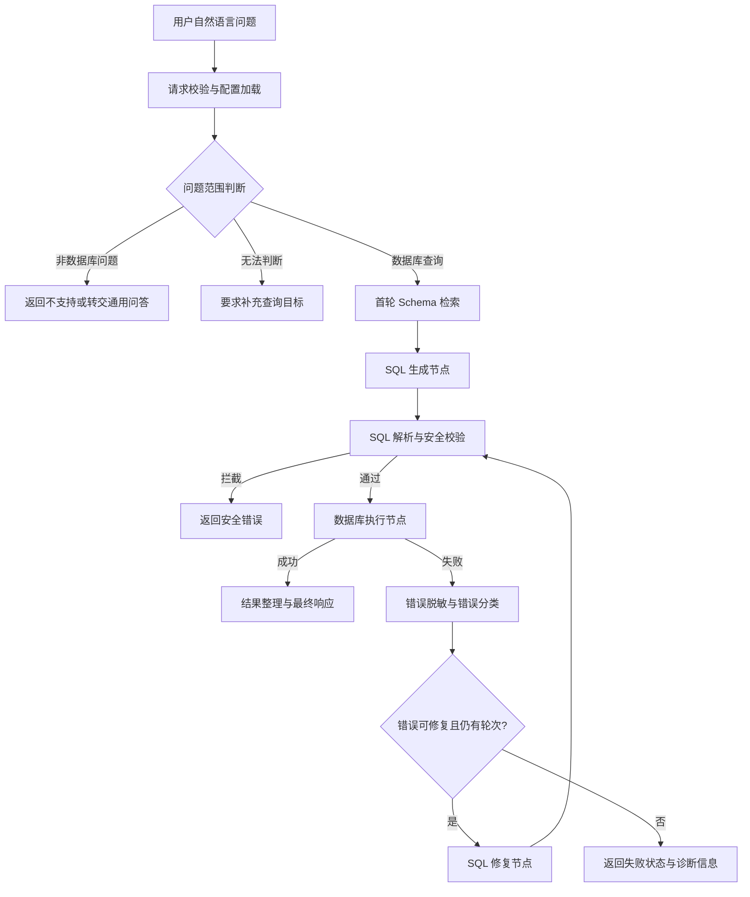
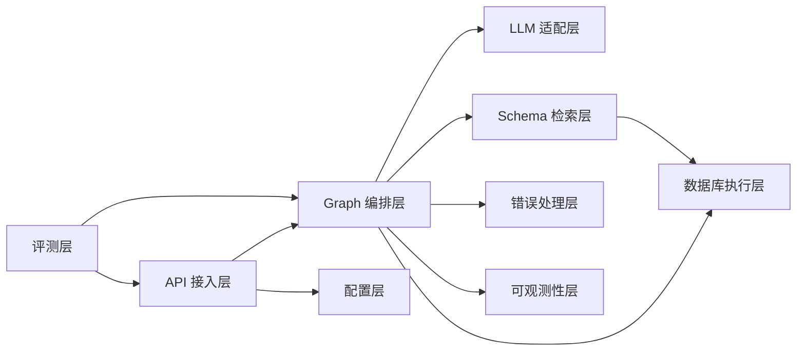

# Chain-NL2SQL 项目开发说明

> 基于 LangGraph 的链式自纠错 NL2SQL 系统，集成 Schema-RAG、SQL 安全治理和可复现实验评测。
>
> 文档性质：开发设计说明。当前仓库处于设计和初始化阶段，文中标记为“规划中”的能力尚未视为已实现。

## 1. 项目概览

### 1.1 项目定位

Chain-NL2SQL 将属于数据查询范围的自然语言问题转换为可执行 SQL，并在 SQL 执行失败时结合数据库错误自动修复。对于与数据库无关的问题，系统应在进入 Schema 检索前识别并拒绝或转交其他问答能力，不得强行生成 SQL。系统使用 LangGraph 管理有状态的节点和循环，而不是直接使用现成的 SQL Agent。

项目主要面向两类场景：

- 面试展示：体现 Agent 状态流转、RAG、工具调用、安全治理和评测能力。
- 实际开发：提供可替换模型、数据库和检索器的后端骨架，支持从 SQLite 平滑迁移到 MySQL。

### 1.2 要解决的问题

单轮 NL2SQL 常见问题包括：

- 模型没有看到正确的表、字段和字段含义，生成不存在的列或错误的关联关系；
- SQL 语法正确但无法执行，或者聚合、过滤、排序逻辑不符合问题意图；
- 用户问题可能与数据库无关，若直接进入 NL2SQL 流程会产生无意义或误导性的 SQL；
- 执行错误直接暴露底层数据库信息；
- Agent 没有最大轮次控制，可能重复生成相同 SQL；
- 只报告“生成成功”，没有执行准确率和失败类型统计。

本项目通过 Schema-RAG 提供上下文，通过执行反馈形成纠错闭环，并用评测数据验证每个模块是否有效。

### 1.3 目标与非目标

目标：

- 提供可运行的 SQLite NL2SQL Demo，并保留 MySQL 适配能力；
- 使用 LangGraph 编排“检索、生成、校验、执行、修复、结束”节点；
- 在 Schema 检索前进行问题范围判断，区分数据库查询、非数据库问题和无法判断的问题；
- 对 SQL 做只读约束和高危操作拦截；
- 记录每一轮的输入、SQL、错误分类和耗时；
- 在 CSpider/Spider 上与单轮基线进行对比。

非目标：

- 不替代完整 BI/报表系统；
- 不允许模型直接执行任意写入 SQL；
- 不在 P0 阶段追求多租户、分布式向量库或复杂权限中心。

## 2. 核心链路

### 2.1 处理流程



### 2.2 关键不变量

1. 问题范围判断必须先于 Schema 检索；非数据库问题不得调用 Schema 检索、SQL 生成或数据库执行节点。
2. Schema 检索只在第一次进入流程时执行，修复循环复用同一份 `schema_context`，防止上下文漂移。
3. 只有通过安全校验的 SQL 才能进入数据库执行节点。
4. `iteration` 表示当前 SQL 尝试编号，从 0（首次生成）开始；`max_iterations` 表示包含首次尝试在内的最大执行尝试次数，默认值为 3。
5. 原始数据库异常只写入受控日志；返回给用户的错误必须经过脱敏和分类。
6. 任意节点发生未处理异常时，图进入可观测的失败结束分支，不继续盲目重试。

### 2.3 问题范围判断

`classify_intent` 是不访问数据库的入口节点，可先使用规则或轻量分类模型；只有分类不确定时才允许调用 LLM。该节点不携带 Schema、数据库连接串、查询结果或其他敏感数据。

| 分类结果 | 判定示例 | 系统行为 |
| --- | --- | --- |
| `database_query` | “本月订单金额最高的客户是谁？” | 进入 Schema 检索和后续 NL2SQL 链路。 |
| `non_database` | “帮我写一封邮件”“今天天气怎么样” | 以 `status=blocked`、`outcome_code=out_of_scope` 结束，返回本服务仅支持数据查询的安全说明；默认不转交外部模型。 |
| `ambiguous` | “帮我看看这个月的情况” | 以 `status=blocked`、`outcome_code=needs_clarification` 结束，并在 `clarification_hint` 要求补充指标、时间范围或数据范围；不得猜测并执行 SQL。 |

范围判断结果及其简短理由必须写入 Trace，便于后续调整分类规则。`non_database` 和 `ambiguous` 都不计入 SQL 尝试次数，也不应作为 SQL 生成、执行或修复失败进入评测分母。若未来接入通用问答模块，应由 API 网关显式路由并使用独立的模型、权限和审计链路，不能复用 NL2SQL 数据库访问权限。

## 3. 技术栈与依赖

| 层次 | 组件 | 用途 | 阶段 |
| --- | --- | --- | --- |
| 图编排 | LangGraph | StateGraph、条件分支、循环和最大轮次控制 | P0 |
| LLM 组件 | LangChain、langchain-openai | Prompt、ChatModel 统一接口 | P0 |
| 生成模型 | DeepSeek-Coder、Qwen2-7B-Instruct、GPT-4o-mini | 生成和修复 SQL | P0 |
| SQL 解析 | sqlglot | 方言感知的 AST 解析和只读策略校验 | P0 |
| 基础 Schema | SQLite/MySQL 元数据读取 | P0 首轮可运行的 Schema 上下文 | P0 |
| 向量检索 | ChromaDB、BGE-small-zh | Schema 向量索引和召回 | P1 |
| 关键词检索 | rank_bm25 | 表名、字段名和业务词匹配 | P1 |
| 重排 | bge-reranker-small | 混合召回结果重排 | P1 |
| Web | FastAPI、Uvicorn | HTTP API 和健康检查 | P0 |
| 类型 | Pydantic v2、TypedDict | 请求响应和图状态约束 | P0 |
| 数据库 | sqlite3、pymysql | SQLite Demo 和 MySQL 适配 | P0/P1 |
| 配置 | python-dotenv | 模型、数据库和迭代参数配置 | P0 |
| 测试 | pytest、httpx | 单元、集成和 FastAPI 接口测试 | P0（开发依赖） |
| 评测 | datasets | CSpider/Spider 加载和批量评测 | P1 |
| 前端框架 | Vue 3、TypeScript | P2 查询、审批和链路展示页面 | P2 |
| 前端构建 | Vite | 开发服务器、构建和环境变量注入 | P2 |
| 前端样式 | Tailwind CSS | 布局、响应式、状态和主题样式 | P2 |
| UI 组件 | Element Plus | 表单、表格、状态提示和布局 | P2 |
| 前端状态 | Pinia、Vue Router | 请求状态、路由和审批状态管理 | P2 |
| HTTP 客户端 | Axios | 类型化 API 请求、超时和错误处理 | P2 |
| 前端测试 | Vitest、Playwright | 组件单测和关键流程端到端测试 | P2（开发依赖） |

`requirements.txt` 除核心运行依赖外，需要补充 `sqlglot`；Python 测试依赖放入 `requirements-dev.txt` 或等价的开发依赖组，至少包含 `pytest` 和 `httpx`。前端依赖单独由 `web/package.json` 管理，至少包含 Vue 3、TypeScript、Vite、Tailwind CSS、Element Plus、Pinia、Vue Router、Axios、Vitest 和 Playwright。所有依赖固定经验证的次版本范围；本说明只定义能力，不代表当前环境已经安装全部依赖。

## 4. LangGraph 状态与节点设计

### 4.1 State 定义

状态建议使用 `TypedDict`，需要暴露给 API 或持久化的嵌套对象使用 Pydantic 模型。

```python
class NL2SQLState(TypedDict):
    request_id: str
    question: str
    database_id: str
    dialect: str
    iteration: int
    max_iterations: int  # 包含首次尝试的总执行次数
    trace: list[TraceEvent]
    status: Literal["running", "succeeded", "blocked", "failed"]
    intent: NotRequired[Literal["database_query", "non_database", "ambiguous"]]
    intent_reason: NotRequired[str]
    outcome_code: NotRequired[Literal["out_of_scope", "needs_clarification"]]
    clarification_hint: NotRequired[str]
    schema_version: NotRequired[str]
    schema_context: NotRequired[list[SchemaDocument]]
    generated_sql: NotRequired[str]
    validated_sql: NotRequired[str]
    query_result: NotRequired[QueryResult | None]
    raw_error: NotRequired[str | None]
    safe_error: NotRequired[str | None]
    error_category: NotRequired[str | None]
    final_answer: NotRequired[str | None]
```

`create_initial_state` 必须在图启动前创建全部必填字段；节点只读取其前置节点已保证存在的可选字段。实现时要保持状态字段单向更新：节点返回增量字典，不直接修改其他节点持有的对象。`raw_error` 只供内部错误分类和日志使用，不得出现在 API 响应中。

### 4.2 节点职责

| 节点 | 输入 | 输出 | 失败处理 |
| --- | --- | --- | --- |
| `classify_intent` | 用户问题 | `intent`、`intent_reason` | `non_database` 直接结束；`ambiguous` 要求补充信息 |
| `retrieve_schema` | `question`、数据库标识 | `schema_context` | 检索为空时进入失败结束 |
| `generate_sql` | 问题、Schema、方言 | `generated_sql` | 临时模型故障按重试策略处理；空输出或非 SQL 输出进入错误分类 |
| `validate_sql` | 生成 SQL | `validated_sql` 或安全错误 | 高危/非只读 SQL 直接阻断 |
| `execute_sql` | 校验后的 SQL | `query_result` 或原始错误 | 数据库错误进入脱敏和分类 |
| `classify_error` | 原始错误、SQL | `safe_error`、`error_category` | 无法分类时使用 `unknown` |
| `repair_sql` | 问题、固定 Schema、SQL、错误 | 新一轮 `generated_sql` | 递增轮次后回到校验节点 |
| `finalize` | 结果或失败状态 | `final_answer`、`status` | 输出统一响应结构 |

推荐的条件路由：

- `classify_intent` 识别为 `database_query` 后进入 `retrieve_schema`；`non_database` 进入不支持/转交分支；`ambiguous` 进入澄清分支；
- `validate_sql` 通过后进入 `execute_sql`，阻断后进入 `finalize`；
- `generate_sql` 产生 `invalid_model_output` 时进入 `classify_error`；该错误最多进入一次修复，随后失败结束；
- `execute_sql` 成功进入 `finalize`，失败进入 `classify_error`；
- `classify_error` 在错误可修复且 `iteration + 1 < max_iterations` 时进入 `repair_sql`，否则进入 `finalize`；
- `repair_sql` 不重新检索 Schema，直接复用当前状态上下文。

### 4.3 防死循环策略

- 默认 `max_iterations=3`，它表示总执行尝试次数，由配置覆盖但设置上限；因此最多包含 1 次首次生成和 2 次修复执行；
- 记录每轮 SQL 指纹，连续生成相同 SQL 时提前终止；
- 对不可修复错误（权限、连接、危险操作）不进行模型重试；
- 模型网络重试使用独立的 `llm_retry_max`（默认不超过 2），只重试超时、限流和临时服务错误；该次数不增加 `iteration`，但必须写入 trace；
- 每轮记录耗时、token 使用量（模型支持时）和错误类型。

## 5. Schema-RAG 设计

### 5.1 Schema 文档化

将数据库元数据转换成可检索文档，每个表至少包含：

- 表名和表注释；
- 字段名、类型、是否可空和字段注释；
- 主键、外键和已知关联关系；
- 可选的业务别名和示例值（脱敏后）。

文档 metadata 至少包含 `database_id`、`table_name`、`column_names` 和 `dialect`，查询时必须按数据库隔离。

### 5.2 混合检索流程

1. 用 BGE-small-zh 对问题和 Schema 文档编码，执行 ChromaDB 向量召回。
2. 对表名、字段名和业务关键词执行 BM25 召回。
3. 合并并去重，使用 bge-reranker-small 重排。
4. 截取固定数量的表和字段，格式化为 SQL 生成 Prompt。
5. 将召回文档和得分写入 trace，便于调试和离线分析。

P1 阶段要提供仅向量、仅 BM25、混合检索三种模式，作为消融实验的开关。

P0 使用数据库元数据读取器生成完整 Schema 上下文，不依赖 ChromaDB 或 Reranker；P1 在不改变 `schema_context` 接口的前提下替换为向量、BM25 和重排组合。中文 CSpider 默认使用 BGE-small-zh；英文 Spider 必须配置英文或多语 embedding，不得直接假设中文 embedding 的效果等价。

### 5.3 Schema 漂移处理

Schema 索引需要记录版本或更新时间。首次检索返回 `SchemaRetrieval(documents, schema_version)`，Graph 将 `schema_version` 固定进 State；数据库执行前以该版本或元数据指纹校验当前 Schema。版本不一致时当前请求以 `schema_changed` 失败并提示重新发起，不在同一循环中偷偷替换上下文。

## 6. SQL 生成、校验与执行

### 6.1 Prompt 约束

生成 Prompt 应明确要求：

- 只使用检索到的表和字段，不凭空编造 Schema；
- 输出单条 SQL，不输出 Markdown 围栏和解释性文字；
- 遵循目标数据库方言；
- 默认只读，禁止修改数据库；
- 需要时使用 LIMIT，避免返回超大结果集。

修复 Prompt 额外提供上一轮 SQL、脱敏错误、错误类别和固定 Schema，并要求只修改必要部分。

模型输出协议固定为结构化对象：`{"sql": "...", "parameters": [...]}`。`sql` 必须使用目标方言的参数占位符（SQLite 使用 `?`，MySQL 使用 `%s`），`parameters` 按占位符出现顺序传给驱动；禁止模型把用户输入拼接进 SQL。参数只允许 JSON 标量（字符串、有限整数/浮点数、布尔值和 `null`），服务端校验数量、长度和类型后才执行；参数值不得写入 trace 或错误日志。模型只需要生成参数化 SQL，不得生成表名、列名或 SQL 片段参数。

### 6.2 安全策略

校验器至少包含以下规则。关键字检查只能作为第一层快速拒绝，不能作为唯一安全边界：

- 只允许单条 `SELECT` 或明确允许的只读语句；
- 拦截 `DROP`、`ALTER`、`DELETE`、`UPDATE`、`INSERT`、`TRUNCATE` 等高危关键字；
- 拒绝多语句拼接、注释绕过和明显的系统表访问；
- 对 SQL 长度、返回行数和执行超时设置限制；
- 在数据库驱动层使用参数绑定，禁止把用户输入直接拼接进 SQL。

执行前使用与目标方言匹配的 SQL parser/AST 做单语句校验，只允许根节点为只读查询，并拒绝 `PRAGMA`、`ATTACH`、存储过程调用、写入型 CTE、`SELECT INTO` 和未允许的系统表访问。SQLite 连接使用只读 URI 或受限副本；MySQL 使用没有写权限的专用账号。超时后必须回收连接，不能复用可能处于异常状态的连接。

只读 SQL 并不等于允许返回全部数据。执行前还要按调用方身份和 `database_id` 应用数据访问策略：表白名单、字段白名单/掩码和可选的行级过滤必须在 SQL 执行前生效；`result_formatter` 在返回前执行最终字段脱敏。P0 本地 Demo 使用固定的允许表和脱敏字段清单，P1 再接入调用方到数据库权限的映射。

`execute_readonly` 接口必须接收单调时钟 `deadline`。SQLite 使用 progress handler 或 `interrupt()` 中断超时查询并销毁连接；MySQL 配置连接/读取超时和会话级最大执行时间，无法确认取消成功时销毁该连接。HTTP 超时不视为数据库查询已取消。

安全校验失败属于 `blocked`，不进入 SQL 修复循环。

### 6.2.1 行级访问策略

行级权限的权威执行点必须是数据库端的受限视图/RLS；在无法使用数据库原生 RLS 的 SQLite Demo 中，由服务端为每个请求选择固定的受限视图，并在 AST 层拒绝直接访问基础表。禁止通过结果返回后的过滤来实现行级权限，因为越权数据已经被查询。策略必须覆盖普通查询、子查询、CTE、聚合和 `SELECT *`，并以 `principal_id`、`database_id` 和策略版本作为审计字段。策略不存在或无法验证时默认拒绝执行。

### 6.3 错误脱敏与分类

错误处理分为三层：进程内 `raw_error` 只供分类节点使用；持久化 trace 只保存脱敏后的 `safe_error`；完整异常和堆栈仅写入受访问控制的安全日志。若启用 LangGraph checkpoint，`raw_error` 不得写入 checkpoint。API 只返回稳定的错误类别和可操作提示。建议分类：

- `syntax_error`：SQL 语法错误；
- `unknown_column`：字段不存在或字段名错误；
- `unknown_table`：表不存在；
- `join_error`：关联条件或关联表错误；
- `aggregation_error`：聚合、分组或排序错误；
- `invalid_model_output`：模型输出为空、包含多段非 SQL 内容或无法解析为单条 SQL；
- `permission_error`：权限不足；
- `connection_error`：数据库连接或超时；
- `unsafe_sql`：安全规则拦截；
- `resource_limit`：触发请求、模型 token/费用、并发或数据库资源上限；
- `unknown`：无法可靠归类。

脱敏内容不得包含密码、连接串、文件路径、主机地址、完整堆栈和未授权的业务数据。安全日志的访问权限、保留周期和删除策略需要由部署环境配置，默认不将完整 SQL 和原始异常写入用户可查询的 trace。

### 6.4 模型数据边界与提示注入

发送给外部模型前只允许包含用户问题、目标方言、经过字段/表白名单过滤的 Schema 文档和脱敏错误；不得发送连接串、主机信息、原始异常、查询结果、未授权字段值或完整示例数据。Schema 注释、知识库内容和数据库对象名称均视为不可信输入，必须作为数据包裹在固定 Prompt 中，不能覆盖系统安全指令。默认关闭模型供应商的数据保留；若供应商无法满足保留、区域和审计要求，禁止用于生产数据。每次请求还要限制最大输入 token、输出 token、调用次数和费用预算，超限进入受控失败。

## 7. 后端接口与工程边界

### 7.1 API 能力

P0 提供以下能力：

- `POST /api/v1/query`：提交自然语言问题并返回最终状态、结果摘要和 trace 摘要；P0 默认不返回 SQL，P1 仅在认证且具备调试角色时返回脱敏后的 SQL；
- `GET /health`：检查服务进程和基础配置；
- `GET /api/v1/databases`：返回当前允许使用的数据库标识，不返回敏感连接信息；生产环境需要认证，避免暴露数据库存在性。

请求模型至少包含 `question`、`database_id` 和可选的 `max_iterations`；服务端必须校验问题非空、轮次在允许范围内、数据库标识存在。P0 仅绑定 `127.0.0.1`，使用本地配置的允许数据库清单，不提供远程多用户访问；P1 增加 API Key 身份、`principal_id` 和 `allowed_database_ids` 映射，调试 SQL 需要独立角色。当前查询接口采用 SSE：发送 `start`、若干 `progress`、一个 `complete` 或 `error` 事件；`complete` 的 data 必须符合 `QueryResponse`，`error` 的 data 只包含稳定 HTTP 状态和安全提示。客户端断开连接时服务端取消 Graph、LLM 和数据库执行并回收资源；超过总截止时间则发送 `error` 后关闭流。若未来改为同步 JSON，必须升级 API 版本或显式协商，不能静默改变现有客户端契约。

响应模型至少包含 `request_id`、`status`、`iteration`、`intent`、`outcome_code`、`clarification_hint`、`error_category`、`final_answer`、`result` 和 `trace`。其中 `result` 固定为 `columns`、`rows`、`row_count` 和 `truncated`，`trace` 只包含节点名、轮次、耗时、错误类别和召回数量。成功时 `error_category=null`；失败时 `result=null`，`final_answer` 为脱敏后的用户提示。Pydantic 模型负责边界校验，LangGraph State 负责流程内状态。

`out_of_scope` 和 `needs_clarification` 不是新的 `status` 值，而是 `status=blocked` 时的 `outcome_code`；两者不得设置 SQL 错误类别，不计入 SQL 轮次和 SQL 评测分母。

### 7.2 配置与日志

使用 `.env` 管理模型和数据库配置，提供 `.env.example`，不得提交真实密钥。日志使用结构化字段记录：

- `request_id`、节点名、迭代轮次；
- SQL 指纹而非默认记录完整 SQL；
- 错误类别、耗时和最终状态；
- 检索文档数量及召回模式。

服务必须配置请求级并发上限、按身份和数据库维度的限流、LLM token/费用预算、数据库连接池上限和熔断策略。达到任一预算时停止后续模型调用并返回可区分的 `resource_limit`；排队、拒绝和取消都要写入指标。P0 可只实现单进程固定上限，但配置项和默认值必须明确，不能依赖反向代理隐式限制。

### 7.3 查询语义与会话边界

P0 查询是无状态单轮请求：不支持“那上个月呢”等跨请求指代，客户端必须提交完整问题。时间解释统一使用服务端配置的 IANA 时区，未指定时区的“今天/本月”以该时区计算；金额、币种、空值、排序稳定性和空结果提示必须在数据库语义配置中定义。P1 才引入会话 `conversation_id` 和历史上下文，并要求每轮重新校验数据库权限，不得把上一轮的 SQL 或 Schema 权限直接继承到新数据库。

## 8. 推荐目录结构

```text
Chain-NL2SQL/
├── app/
│   ├── main.py                 # FastAPI 入口
│   ├── config/
│   │   ├── settings.py          # 环境变量和默认配置
│   │   └── validation.py        # 配置合法性校验
│   ├── api/
│   │   ├── routes.py            # HTTP 路由
│   │   ├── dependencies.py      # 权限、请求上下文和依赖注入
│   │   ├── authorization.py     # 身份与数据库访问策略解析
│   │   └── response_mapper.py   # State 到 API 响应的转换
│   ├── schemas/
│   │   ├── request.py            # 请求模型
│   │   ├── response.py           # 响应模型
│   │   └── domain.py             # Schema、结果和 trace 模型
│   ├── graph/
│   │   ├── state.py              # LangGraph State 和初始化
│   │   ├── builder.py            # 图构建
│   │   ├── routes.py             # 条件路由
│   │   ├── generation_node.py    # 首次 SQL 生成
│   │   ├── validation_node.py    # SQL 校验节点
│   │   ├── execution_node.py     # SQL 执行节点
│   │   ├── repair_node.py        # 错误修复节点
│   │   └── finalize_node.py      # 统一结束节点
│   ├── rag/
│   │   ├── introspector.py       # SQLite/MySQL 元数据读取
│   │   ├── normalizer.py         # 元数据标准化
│   │   ├── document_builder.py   # SchemaDocument 构建
│   │   ├── index_manager.py      # 索引版本、构建和受控重建
│   │   ├── vector_store.py       # ChromaDB 索引读写
│   │   ├── bm25_store.py         # BM25 索引读写
│   │   ├── hybrid_retriever.py   # 混合召回与去重
│   │   └── reranker.py           # 结果重排
│   ├── llm/
│   │   ├── client.py             # ChatModel 适配器
│   │   ├── factory.py            # 模型选择和生命周期
│   │   ├── prompts.py            # 生成和修复 Prompt
│   │   ├── output_parser.py      # 模型输出清洗和 SQL 提取
│   │   └── retry_policy.py       # 模型调用重试和超时
│   ├── db/
│   │   ├── base.py               # 数据库适配器接口
│   │   ├── sqlite_adapter.py     # SQLite 连接和执行
│   │   ├── mysql_adapter.py      # MySQL 连接和执行
│   │   ├── connection_manager.py # 连接创建、回收和超时
│   │   ├── security_policy.py    # AST、只读和数据访问策略
│   │   └── result_formatter.py   # 行数限制和结果标准化
│   ├── errors/
│   │   ├── categories.py         # 错误分类枚举
│   │   ├── classifier.py         # 驱动异常到业务错误
│   │   └── redactor.py           # 错误和 SQL 脱敏
│   └── observability/
│       ├── trace.py              # 节点级 trace
│       ├── logging.py            # 结构化日志
│       └── metrics.py            # 轮次、耗时和成功率指标
├── evals/
│   ├── datasets.py              # CSpider/Spider 加载
│   ├── baseline.py              # 单轮基线
│   ├── run_eval.py              # 批量评测
│   └── reports.py               # 指标和失败分类
├── tests/
│   ├── fakes/
│   │   └── fake_llm.py          # 可编排的确定性模型响应
│   ├── unit/
│   └── integration/
├── data/
│   ├── demo.sqlite               # 固定 SQLite 演示库
│   ├── schema_metadata/          # 演示库元数据快照
│   └── fixtures/                 # 测试问题、预期结果和异常样例
├── web/                          # P2 Vue3 + Element Plus 前端
│   └── src/
│       ├── api/                  # 后端客户端
│       ├── router/               # 页面路由和权限守卫
│       ├── types/                # API 响应和领域类型
│       ├── views/                # 查询和审批页面
│       ├── components/           # 结果表格和链路时间线
│       ├── stores/               # 请求和链路状态
│       └── tests/                # Vitest 和 Playwright 测试
├── requirements.txt
├── requirements-dev.txt
├── .env.example
└── README.md
```

### 8.1 模块拆解与依赖方向

模块拆分遵循“一个模块只负责一个变化原因”。大模块之间通过接口和领域模型通信，不直接跨层访问实现细节。



#### API 接入层

- `routes.py`：只负责 HTTP 参数接收、调用应用服务和返回 HTTP 状态码，不编排 LangGraph 节点。
- `dependencies.py`：校验数据库权限、调试角色和请求级超时，生成 `request_id`。
- `authorization.py`：P0 返回本地固定访问策略；P1 将 API Key 解析为 `principal_id`、允许数据库和调试角色，不能由客户端自行声明权限。
- `response_mapper.py`：将内部 State 转换成稳定的响应模型，确保 `raw_error`、连接信息和未授权 SQL 不会出现在响应中。

输入是 `QueryRequest`，输出是 `QueryResponse`；API 层不得直接调用数据库驱动或 LLM SDK。

#### 配置层

- `settings.py`：读取模型、数据库、检索、超时、结果行数和日志策略配置。
- `validation.py`：启动时校验必填密钥、数据库方言、最大轮次和超时的范围。

配置对象在应用启动时构建并只读传递，节点不得在运行过程中修改全局配置。

#### Graph 编排层

- `state.py`：定义 State、初始状态和状态字段默认值；禁止未初始化字段进入节点。
- `builder.py`：注册节点和边，只负责构图。
- `routes.py`：只根据 State 做路由，不包含模型调用或数据库操作。
- 各节点文件只实现一个节点，依赖 `SchemaRetriever`、`LLMClient`、`DatabaseExecutor` 等接口。

Graph 层负责流程控制，不负责实现检索算法、SQL parser 或 HTTP 响应格式化。

#### LLM 适配层

- `client.py`：统一 `generate(prompt, timeout) -> ModelResponse` 接口。
- `factory.py`：根据配置创建 DeepSeek、Qwen 或 OpenAI 兼容客户端。
- `output_parser.py`：去除 Markdown 围栏、提取单条 SQL，并在空输出或多语句时返回结构化错误。
- `retry_policy.py`：只处理网络、限流和临时服务错误；不对 SQL 语义错误做盲目重试。

LLM 层只返回结构化模型结果，不读取数据库、不写 State，也不决定是否进入修复循环。

#### Schema 检索层

- `introspector.py`：从数据库读取原始表、字段、键和注释。
- `normalizer.py`：统一不同数据库方言的元数据字段。
- `document_builder.py`：将标准化元数据转换成 `SchemaDocument`。
- `vector_store.py`、`bm25_store.py`：分别负责索引构建和召回。
- `hybrid_retriever.py`：负责合并、去重、过滤和截断。
- `reranker.py`：只负责候选排序，不负责修改文档内容。
- `index_manager.py`：按 `database_id` 和 Schema 版本构建索引；Schema 变更后由受控任务重建，在线查询不会自行重建索引。

Graph 只依赖 `SchemaRetriever.retrieve(question, database_id) -> SchemaRetrieval`，其中包含 `documents` 和 `schema_version`；因此 P0 基础读取器和 P1 混合检索器可以互换，同时保持请求内的 Schema 版本一致。

#### 数据库执行层

- `base.py`：定义 `inspect_schema`、`execute_readonly(sql, deadline, access_policy)` 和 `close` 接口。
- `*_adapter.py`：实现具体驱动差异，不向上层暴露驱动异常类型。
- `connection_manager.py`：负责连接生命周期、取消超时 SQL、回收和并发隔离。
- `security_policy.py`：执行 AST 解析、只读白名单、系统表限制、资源限制和表/字段/行级访问策略检查。
- `result_formatter.py`：统一列名、行数限制、截断标记和可序列化结果。

执行顺序固定为：安全校验 -> 创建或获取只读连接 -> 执行 -> 结果格式化 -> 释放连接。

#### 错误处理与可观测性层

- `categories.py`：定义稳定的业务错误类别。
- `classifier.py`：将 SQLite、MySQL、LLM 和检索异常映射为业务类别。
- `redactor.py`：统一处理异常、SQL、连接串和结果字段脱敏。
- `trace.py`：记录节点开始、结束、耗时、轮次和摘要字段。
- `metrics.py`：计算执行成功率、修复成功率、迭代次数和延迟。

错误处理层是所有外部异常进入 State 前的唯一入口；可观测性层不得反向调用 Graph、LLM 或数据库。

#### 评测层

- `datasets.py`：加载数据集、数据库和标准 SQL，生成统一样本结构。
- `baseline.py`：执行不带修复循环的单轮基线。
- `run_eval.py`：固定配置并批量调用应用服务。
- `metrics.py`：执行结果规范化和 EX 判定。
- `reports.py`：输出 manifest、汇总指标和失败样例。

评测层只通过应用接口或 Graph 应用服务运行，不复制生产节点逻辑；否则基线和正式方案可能使用不同的 SQL 执行规则。

#### P2 扩展模块

- Human-in-the-Loop：`approval_service` 负责审批状态和审计记录，`checkpoint_store` 负责持久化可恢复 State，`resume_handler` 只在审批通过后恢复指定请求；审批拒绝直接进入 `finalize`，不得重新执行 SQL。
- Example-RAG：`example_store` 存储已脱敏的问题-SQL 示例，`example_retriever` 负责按数据库和问题召回，`prompt_assembler` 负责将示例和固定 Schema 拼入 Prompt；示例检索失败不能影响主 Schema-RAG 流程。
- 前端：`api` 只访问稳定 HTTP 接口，`views` 组合页面，`components` 展示结果和 trace，`stores` 管理请求状态；前端不得保存连接串、原始异常或未授权 SQL。

#### 前端页面与数据流

- `QueryView`：选择数据库、提交问题、展示加载/成功/阻断/失败/空结果状态。
- `ApprovalView`：展示待审批的脱敏 SQL 和 Schema 摘要；只有后端返回可审批状态时显示“通过/拒绝”。
- `IterationTimeline`：按节点和迭代展示耗时、错误类别、检索数量和最终状态，不展示 `raw_error`。
- `ResultTable`：使用 `columns`、`rows`、`row_count`、`truncated` 渲染结果，明确提示结果被截断。
- `api/client.ts`：使用 Axios 访问 `/api/v1/query`、健康检查和审批接口，统一超时、取消和错误映射；API 类型从 `types/` 导出。
- `stores/query.ts`：管理一次请求的生命周期和 trace；页面刷新后不得假设本地状态仍可恢复，恢复能力由后端 checkpoint 决定。

前端不直接连接数据库、不执行 SQL、不拼接 Prompt。P2 首版使用同步查询接口；后续如增加 SSE/WebSocket，只替换 API 客户端和状态层，不改变结果与 trace 数据结构。Vitest 覆盖状态转换和组件边界，Playwright 覆盖“提交问题 -> 展示结果/错误 -> 审批”主流程。

## 9. 评测设计

### 9.1 指标

- EX accuracy：生成 SQL 在目标数据库上执行结果与标注结果一致的比例。比较前统一列顺序、NULL 表示和数值精度；对无序结果按规范化后的行集合比较，对超时、执行异常和安全拦截统一判为失败；
- SQL validity：通过语法和安全校验的比例；
- repair success rate：首次执行失败后最终修复成功的比例；
- average iterations：所有请求的平均迭代轮次；
- failure distribution：按错误类别统计失败数量和占比；
- latency：端到端耗时以及各节点耗时。

### 9.2 对照实验

至少比较以下方案：

1. 单轮生成，不执行修复；
2. 单轮生成 + Schema-RAG；
3. Schema-RAG + 执行反馈自纠错；
4. 向量检索、BM25 和混合检索的消融结果。

评测报告应固定模型标识和参数、Prompt 版本、embedding/reranker 版本、数据集 commit 或版本、数据库镜像/Schema 版本、最大迭代次数、随机种子和评测脚本版本，并保存失败样例，避免只展示平均分。评测环境信息写入报告 manifest，确保结果可复现。

## 10. 开发优先级与验收标准

### P0：可运行核心闭环

实现 LangGraph 主链路、固定 SQLite 演示库及 fixtures、SQLite 执行器、基础 SQL 生成、基于 sqlglot 的只读安全校验、错误脱敏、最大迭代限制、FastAPI 查询接口和结构化日志。

验收标准：给定测试数据库和模型配置，能够完成基础 Schema 读取、成功查询、语法错误修复、不可修复错误终止、高危 SQL 拦截，以及非数据库问题不访问 Schema 或数据库并返回受控提示六类场景。

### P1：检索与评测增强

实现 Schema 元数据加载、ChromaDB + BM25 混合检索、Reranker、MySQL 适配、CSpider/Spider 批量评测和单轮基线。

验收标准：可以重复运行评测，输出 EX、迭代轮次、耗时和失败分类，并能通过开关完成检索策略消融。

### P2：扩展交互能力

实现 Human-in-the-Loop SQL 审批、Example-RAG Few-shot 检索和 Vue3 + Element Plus 前端链路展示。

前端演示扩展包括知识库管理页面：支持 TXT、Markdown、PDF、DOCX、CSV 文件的类型与大小校验、模拟解析与索引状态、资料元数据查看和删除。演示模式仅在浏览器内维护文件元数据与安全摘要，不上传或持久化原始文件，不执行真实文本解析、向量化或生产检索。已索引资料可作为查询页面的知识命中摘要展示，用于补充业务规则、指标口径和数据字典；它不替代按数据库隔离的 Schema-RAG，也不改变 SQL 安全校验与数据访问策略。

验收标准：审批前 SQL 不执行；前端能够展示每轮状态、检索上下文、SQL、错误和最终结果；扩展功能不改变 P0 API 契约。

## 11. 测试策略

### 单元测试

- State 初始化、轮次递增和条件路由；
- 使用 `fake_llm` 覆盖有效 SQL、空输出、Markdown 包裹 SQL、多语句和临时模型错误，保证 Graph 分支测试不依赖远程模型；
- 高危 SQL、注释绕过、多语句和只读语句校验；
- 错误脱敏和错误分类；
- Schema 文档解析、去重和数据库隔离；
- 结果截断和统一响应模型。

### 集成测试

- 使用固定 SQLite 数据库跑完整 LangGraph；
- 模拟模型返回语法错误 SQL，验证自动修复；
- 模拟连续相同 SQL，验证提前终止；
- 模拟连接超时和权限异常，验证不泄露敏感信息；
- 验证调用方无法访问未授权的表/字段，且返回结果会应用字段脱敏；
- 验证 Schema 版本在检索后发生变化时，执行前以 `schema_changed` 终止；
- 验证多语句、注释绕过、`PRAGMA`/`ATTACH`、写入型 CTE 和 `SELECT INTO` 均被拒绝；
- 验证超时后连接被回收，后续请求不会复用异常连接；
- 验证 trace 只含脱敏错误和允许的调试字段；
- 验证非数据库问题返回 `outcome_code=out_of_scope`，模糊问题返回 `outcome_code=needs_clarification`，两者均不访问 Schema/数据库；
- 验证参数化 SQL 的占位符、参数数量和参数类型校验，且参数值不进入 trace；
- 验证行级策略覆盖子查询、CTE、聚合和 `SELECT *`，策略缺失时默认拒绝；
- 验证 SSE 的 `start/progress/complete/error` 事件契约、客户端断开取消和总截止时间；
- 验证模型 Prompt 不包含连接信息、原始异常、查询结果和未授权 Schema 内容；
- 验证限流、并发、token/费用预算和连接池上限触发后返回资源受限状态；
- FastAPI 请求校验、健康检查和错误响应。

### 回归与评测

每次修改 Prompt、检索策略或模型适配器后运行固定样例集，并比较 EX、修复成功率、平均轮次和延迟。指标下降时保留失败 trace，便于定位是召回、生成、执行还是路由问题。

## 12. 后续扩展

- Human-in-the-Loop：在 `validate_sql` 后增加人工审批中断点，审批通过后才进入执行。
- Example-RAG：按问题语义和数据库 Schema 检索相似问题-SQL 对，作为生成 Prompt 的 Few-shot 示例。
- 前端：以时间线展示节点流转和每轮 SQL，敏感字段在前后端同时脱敏。
- 持久化：为生产环境增加 LangGraph checkpoint 和请求审计存储，但不改变核心状态字段。

## 13. 面试讲解重点

建议围绕以下问题准备实现细节和实验数据：

1. 为什么采用 LangGraph，而不是简单的 while 循环？
2. 如何保证修复阶段不发生 Schema 漂移？
3. 混合检索如何合并向量召回和 BM25 结果？
4. 哪些数据库错误适合交给模型修复，哪些错误必须终止？
5. 如何防止模型生成 DROP、DELETE 或多语句 SQL？
6. 如何证明自纠错方案优于单轮 NL2SQL？
7. 如何处理重复 SQL、最大轮次和模型调用失败？

这些问题都应能在代码、日志和评测报告中找到对应证据，而不是只停留在技术栈描述层面。
